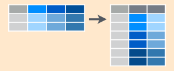
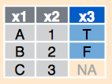
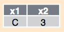

# Table of contents

- [Cheat sheet for tidyr functions](#cheat-sheet-for-tidyr-functions)
- [Stop. How do we want to handle a data set in RStudio?](#stop.-how-do-we-want-to-handle-a-data-set-in-rstudio)
- [Quick refresher on dplyr](#quick-refresher-on-dplyr)
    + [filter() and select() functions](#filter-and-select-functions)
        - [select() function](#select-function)
        - [filter() function](#filter-function)
    + [Structure of tidyr](#structure-of-tidyr)
    + [Tidyr gather() and spread() functions](#tidyr-gather-and-spread-functions)
        - [gather() function](#gather-function)
        - [spread() function](#spread-function)
        - [Introducing the unite() function](#introducing-the-unite-function)
- [Cheatsheet for dplyr functions](#cheatsheet-for-dplyr-functions)
     + [inner_join(overpriced_coffee_shop_menu, coffee_brand)](#inner_joinoverpriced_coffee_shop_menu-coffee_brand)
     + [semi_join(overpriced_coffee_shop_menu, coffee_brand)](#semi_joinoverpriced_coffee_shop_menu-coffee_brand)
     + [left_join(overpriced_coffee_shop_menu, coffee_brand) ](#left_joinoverpriced_coffee_shop_menu-coffee_brand)
     + [right_join(overpriced_coffee_shop_menu, coffee_brand)](#right_joinoverpriced_coffee_shop_menu-coffee_brand)
     + [anti_join(overpriced_coffee_shop_menu, coffee_brand)](#anti_joinoverpriced_coffee_shop_menu-coffee_brand)
     + [inner_join(coffee_brand, overpriced_coffee_shop_menu)](#inner_joincoffee_brand-overpriced_coffee_shop_menu)
     + [semi_join(coffee_brand, overpriced_coffee_shop_menu)](#semi_joincoffee_brand-overpriced_coffee_shop_menu)
     + [left_join(coffee_brand, overpriced_coffee_shop_menu)](#left_joincoffee_brand-overpriced_coffee_shop_menu)
     + [anti_join(coffee_brand, overpriced_coffee_shop_menu)](#anti_joincoffee_brand-overpriced_coffee_shop_menu)
     + [full_join(overpriced_coffee_shop_menu, coffee_brand)](#full_joinoverpriced_coffee_shop_menu-coffee_brand)
- [Activity 3: Optional add-on to previous exercises](#activity-3-optional-add-on-to-previous-exercises)
     + [Explore the base R function merge()](#explore-the-base-r-function-merge)
        - [inner_join vs corresponding merge function](#inner_join-vs-corresponding-merge-function)
        - [full_join vs corresponding merge function](#full_join-vs-corresponding-merge-function)
        - [left_join vs corresponding merge function](#left_join-vs-corresponding-merge-function)
        - [right_join vs corresponding merge function](#right_join-vs-corresponding-merge-function)
        - [cross join and the lack of a dplyr equivalent](#cross-join-and-the-lack-of-a-dplyr-equivalent)
        - [So are the dplyr join functions superior to the base R merge function?](#so-are-the-dplyr-join-functions-superior-to-the-base-r-merge-function)
     + [Explore the base R function merge()](#explore-the-base-r-function-merge)
        - [right_join vs corresponding merge function](#right_join-vs-corresponding-merge-function)
        - [cross join and the lack of a dplyr equivalent](#cross-join-and-the-lack-of-a-dplyr-equivalent)
        - [So are the dplyr join functions superior to the base R merge function?](#so-are-the-dplyr-join-functions-superior-to-the-base-r-merge-function)
     + [Explore the base R function match()](#explore-the-base-r-function-match)
     
# Cheat sheet for tidyr functions

A very helpful RStudio cheat sheet on tidyr functions and data wrangling can be found [here](https://www.rstudio.com/wp-content/uploads/2015/02/data-wrangling-cheatsheet.pdf). Refer to that guide if you have any immediate questions. It will probably help :smile: My cheat sheet aims to be a highlight reel of that guide along with answering a few other interesting questions. Hence, I will use a few images from the RStudio guide in my own cheat sheet. 

# Stop. How do we want to handle a data set in RStudio?

The below flow chart gives us an idea of how we want to handle a data set that we use in RStudio. We first want to import the data, tidy it, then do some data manipulations, transformations or modelling. Finally, we can relay our finished product to our targeted audience in a way that is easily accessible.


Ok. The flowchart seems pretty straight-forward. So, first I will load the packages that I will require for this assignment.

By loading the tidyverse package, we get a big bang for our buck because get that the  ggplot2, dplyr, tidyr, and tibble packages are also loaded. I also will load the knitr package so we can make sleek tables pretty easily.

```{r message=FALSE}
# I suppressed the messages that appear when I load the packages typing ```{r message=FALSE} at the top of this code block. 

library(tidyverse) # load tidyverse package
library(knitr) # for kable() function to make tables spiffy
```

I will use the cereal data set, which I downloaded from [here](https://gist.github.com/SinnerShanky/925f08febd10b40b8b5e). In this data set, there are 74 different types of breakfast cereals, their manufacturer (ie. Nabisco, Quaker Oats, Kellogs, Ralston Purina, General Mills, Post, and American Home Food Products), the calories, protein (g), fat, sodium, dietary fiber, carbs, sugars, display shelf (1, 2 or 3 beginning from the floor shelf), potassium, vitamins and minerals, serving size weight, and cups per serving. Also, I have attached the csv of this data set in my HW04 repo., just in case if it is not loading on Github.

```{r}
cereal <- read_csv("https://gist.githubusercontent.com/SinnerShanky/925f08febd10b40b8b5e/raw/61013864f780e43a99349cc1e31fc89b39d862c0/cereal.csv") # read the csv in from the raw file on Github
```

Let's look at the top six rows of the cereal data set, to get an idea of what the data set looks like. Additionally, I will look at the dimensions of the data set to see if I would like to just look at a subset of the data. 

```{r}
head(cereal) # see top six rows of dataset. 

dim(cereal) # dimensions are 74 rows by 15 columns
```

Since there are a lot of columns to deal with, to we will just use a subset of the data by selecting only the columns we require. 

# Quick refresher on dplyr

## filter() and select() functions

In the dplyr() package, we have two handy tools to quickly and easily select certain rows or columns of a data frame. 

### select() function 


The function select() allows us to choose what columns we want from all the possible columns of our data.

**Example:**

We will look at the cereal data and select only the `Cereal Name`, Manufacturer, Calories, Sugars, Protein (g), Fat, and `Display Shelf` columns to keep our lives simple when we do further data manipulation and analysis.

```{r}
# Let's use the cereal data to show the select function in action!

cereal_subset <- cereal %>% 
  select(`Cereal Name`, Manufacturer, Calories, Sugars, `Protein (g)`, Fat, `Display Shelf`) # say we just want to select the `Cereal Name`, Manufacturer, Calories, Sugars, Protein (g), Fat, and `Display Shelf` columns.
  
cereal_subset %>% 
  head() %>% # let's look at the top six rows of this subset of the chosen variables
  kable() # kable table it.
```

### filter() function


The function filter() is used to choose the desired rows of the data. For the cereal.subset data, suppose we are a cereal purist and only want the Nabisco cereals. Hence, we will filter the cereal.subset data just for the rows of Nabisco cereals in the next code block.

**Example:**

```{r}
# Now let's see the filter() function in action!

cereal_subset_Nabisco <- cereal_subset %>% 
  filter(Manufacturer == "Nabisco") # filter for just the Nabisco cereals 

cereal_subset_Nabisco %>% 
  head() %>% # View top six rows to make sure we only got the Nabisco cereals
  kable() # kable table
```

## Structure of tidyr


The structure of tidyr is what you would expect. Variables are the column names, while elements (ie. observations) are put into the rows. No surprises here.

## Tidyr gather() and spread() functions

This table which I adapted from [here](https://tidyr.tidyverse.org), provides a good translation of the terms gather and spread in the reshape2 package, spreadsheets and databases. The translations should help you to gain a intuitive feel for the functions. 

| tidyr | gather  | spread |
| --- |---| ---| 
|  reshape(2)  | melt | cast | 
|  spreadsheets | unpivot | pivot |
|  databases | fold |  unfold |

Now, let's have a closer look at the structure of the gather() and spread() functions by talking about what exactly to put in the arguments. Note that the image below was obtained from [Tyler Rinker’s minimal guide to tidyr](https://github.com/trinker/tidyr_in_a_nutshell).


The above image explains that in the gather() function. When we use the gather() function, we get a key-value pair. The **key** is the name of a new column for the new variable, while the **value** is the name of the column which will contain values. The **...** refers to the columns that are included or excluded from gather(). 

The key-value pair is also used in the spread() function. For this function, the **key** is the column that we want to turn into multiple columns, while the **value** corresponds to the values that we want to turn into multiple column values. 

### gather() function 



The gather function takes data from a wide form and puts it into a long or tidy form. Think of the function as putting data from spreadsheet format into calculation format. The long form the function produces isn't the most visually-appealing, but it makes it easy to perform calculations and operate on the data. 

**Example: **

We will put the Sugars, `Protein (g)` and Fat data (which were all measured in grams) into one column called Nutrients using the gather() function.

```{r}
cereal_subset_Nabisco_long <- cereal_subset_Nabisco %>% 
  gather(key = "Nutrients", value = Values(g), 3:5) # put sugars, proteins and fat (all in g) of Nabisco cereals into one column called Nutrients

cereal_subset_Nabisco_long # Let's see what happened!
```

We should get the same output if we specify the columns as a range from 3:5 because columns 3 - 5 in the cereal.subset.Nabisco tibble are the sugars, proteins and fat columns. 

```{r}
cereal_subset_Nabisco_long2 <- cereal_subset_Nabisco %>% 
  gather(key = "Nutrients", value = Values(g), Sugars, `Protein (g)`, Fat) # put sugars, proteins and fat (all in g) of Nabisco cereals into one column called Nutrients

cereal_subset_Nabisco_long2
```

Booyah! We got the same output, so either way works.

** Example 2: **

Suppose an Australian and an American go shopping for breakfast cereal. So, we want the kilojoules (kJ) listed as energy measurments of the Nabisco cereals as well as the Calories. We can first create a new column with the kilojoules displayed using the mutate() function. Then, we will use the gather() function to make one column called Energy Measure that will have both the Calories and kilojoules of the cereals. So, the value column will containt the number of Calories and the number of kilojoules for each cereal. By using the gather function, the data frame is ready for calculations.

```{r}
cereal_subset_Nabisco %>% 
  mutate(kilojoules = Calories * 4.184) %>%  # convert Calories to kilojoules by multiplying the calories by 4.184
  gather(key = "Energy Measurement", value = "Energy Count", Calories, kilojoules) # gather Calories and kilojoules into a column called Energy Measurement and put their values in a column called Energy Count
  
```


### spread() function 

The spread function takes data from a long form and puts it into a wide form. Think of the function as putting data from calcuation format to speadsheet format. The wide form is more visually appealing. Hence, it would be useful for displaying data to your targeted audience on a website, in a book, or in an article. 


**Example:**

One misleading way to to think of the spread function is that can "undo" the gather function. We must be careful with this line of thinking because the arrangement of the tibble columns may change when we try to "undo" the gather() function, which we will see in the example below. We will step into this trap and show that pitfall by trying to undo what we did with the gather function above to put the sugars, proteins and fat (all in g) of Nabisco cereals into one column called Nutrients.

Using the cereal.subset.Nabisco.long data and the spread() function, we will put the Fat, `Protein (g)`, and Sugars (which were all measured in grams) from the one column called Nutrients into each of their own columns. 

```{r}
cereal_subset_Nabisco_wide <- cereal_subset_Nabisco_long %>%
  spread(key = "Nutrients", value = "Values(g)") # puts the nutrients  Fat, `Protein (g)`, and Sugars each into their own columns

cereal_subset_Nabisco_wide
```

So, the Nutrients column has now been split back into the Fat, `Protein (g)`, and Sugars columns as we originally had. Note that the order of the columns is now different. It makes sense that the appears that the Fat, `Protein (g)`, and Sugars columns appeared after the `Display Shelf` column because the Nutrients column was after the `Display Shelf` column in the cereal.subset.Nabisco.long tibble. Also, observe that the columns Fat, `Protein (g)`, and Sugars have been sorted alphabetically in the new cereal.subset.Nabisco.wide tibble. We don't have the original order Sugars, `Protein (g)` and Fat that we had in the cereal.subset.Nabisco tibble.

### Introducing the unite() function

We can combine the data from two variables by using the unite() function. 

**Example:**

First, we will arrange the Manufacturer_Shelf column in descending order (ie. top to bottom shelf) by using the dplyr function arrange(). Then, let's unite the columns of Manufacturer and Display Shelf to investigate which manufacturers get top-shelf and bottom-shelf priority. 

```{r}
manuf_shelf_subset <- cereal_subset %>% 
  arrange(desc(`Display Shelf`)) %>%  # arrange from top to bottom shelf
  unite(Manufacturer_Shelf, Manufacturer, `Display Shelf`) 

# peak at the head of the manuf.shelf.subset 
head(manuf_shelf_subset) %>% 
  kable() # kable table of head of data
```

Excellent. The top few rows are from the top shelf. 

Now, let's check that the bottom few rows of the data to see that the brands are on the first shelf. 

```{r}
tail(manuf_shelf_subset) %>% 
  kable() # kable table of tail of data
```

The tail table is looking good. Now, we should check the whole data set to make sure it runs from the top shelf to the bottom shelf, but I will leave that as a tedious exercise to the reader. 

# Cheatsheet for dplyr functions

We already loded the tidyverse package above, so I will not load that again. If we didn't load the tidyverse package above, we should load it so we could access the dplyr package. 

So, I will start by constructing a menu for an overpriced coffee shop. This bare-bones menu will contain the name of the drink, the drink type (espresso-based, caffinated drip coffee, or tea), and the pricey price ($) of the drink.

```{r}
overpriced_coffee_shop_menu <- "
    name, drink_type, price ($)
 latte, espresso-based, 6.00
   cappuccino, espresso-based, 6.00
americano, espresso-based, 5.00
  cafe_mocha, espresso-based, 6.50
ice_coffee, caffinated drip coffee, 4.00
 plain_ol_coffee, caffinated drip coffee, 4.00
cuppa_tea, tea, 3.00
"

overpriced_coffee_shop_menu <- read_csv(overpriced_coffee_shop_menu, skip = 1)

overpriced_coffee_shop_menu$`price ($)` <- formatC(overpriced_coffee_shop_menu$`price ($)`, format = 'f', flag='0', digits = 2) # make sure price_in_dollars is to two decimal places

(overpriced_coffee_shop_menu) # Let's see the overpriced coffee shop menu!

```

Next, I will construct a csv for the drink brand for the three drink types, espress-based, tea, and drip coffee. 

```{r}
coffee_brand <- "
    drink_type, brand
    espresso-based, Lavazza Super Crema
    caffinated drip coffee, Kicking Horse Coffee
    decaf drip coffee, Maxwell House
"

(coffee_brand <- read_csv(coffee_brand, skip = 1))
```

You will observe that my cheatsheet is structured and patterened after [Jenny's cheatsheet](http://stat545.com/bit001_dplyr-cheatsheet.html). Also, note that the definitions I will refer to for each of the join functions are from [here](https://dplyr.tidyverse.org/reference/join.html). 

## inner_join(overpriced_coffee_shop_menu, coffee_brand)

 


> inner_join(x, y): Return all rows from x where there are matching values in y, and all columns from x and y. If there are multiple matches between x and y, all combination of the matches are returned. This is a mutating join.

```{r}
(ij_csm_cb <- inner_join(overpriced_coffee_shop_menu, coffee_brand)) # use the inner_join function to join the two tibbles and show output
```

We can see that the function automatically joins by "coffee_type". That is because the common variable between both of the tibbles is drink_type. 

Notice that when we use the inner_join function, we miss the tea brand because the tea brand was not included in the coffee_type tibble. Additionally, we can see that we get all the variables from both tibbles when we use the inner_join function.

## semi_join(overpriced_coffee_shop_menu, coffee_brand) 

 


> semi_join(x, y): Return all rows from x where there are matching values in y, keeping just columns from x. A semi join differs from an inner join because an inner join will return one row of x for each matching row of y, where a semi join will never duplicate rows of x. This is a filtering join.

```{r}
(sj_csm_cb <- semi_join(overpriced_coffee_shop_menu, coffee_brand)) # use the semi_join function to join the two tibbles and show output


```

As we had with the inner_join function, we can see that the semi_joinfunction automatically joins by "coffee_type". That is because the common variable between both of the tibbles is drink_type.

Notice that the resulting tibble only contains the variables that we had in overpriced_coffee_shop_menu tibble and not the additional varaibles from the coffee_brand tibble.

We can easily see the difference between the tibbles resulting from the semi_join function and the inner_join function by looking at a side-by-side comparison of them.

I will load the gridExtra package to display the tables side-by-side. Note that in order to use the grid.arrange() function on the two tables, I first had to convert them each to tableGrob. The left is the semi_join function result, while the right is the inner_join function result. I couldn't find a quick way to add a title to each tableGrob. I think that revealed one of the drawbacks of usign a tableGrob. Now, the code I used to add a title to each tableGrob was found [here](https://stackoverflow.com/questions/31640916/how-can-i-add-a-title-to-a-tablegrob-plot).

```{r}
library(gridExtra) # load gridExtra package 
library(grid) # load grid package to use textGrob() function to add titles to table (for example, I used function textGrob() from this package)
library(gtable) # load gtable package to add titles to tables (for example, I used functions gtable_add_rows() and gtable_add_grob() from this package).


sj_Grobtable <- tableGrob(sj_csm_cb, theme=ttheme_default(
    core = list(fg_params=list(cex = 0.55)), # smaller table text size
    colhead = list(fg_params=list(cex = 0.55)), 
    rowhead = list(fg_params=list(cex = 0.55)), rows=NULL))  # transform sjcsm into a tableGrob

# add title to sj_Grobtable
title <- textGrob("semi_join function result", gp = gpar(fontsize = 10))
padding <- unit(0.5,"line")
sj_Grobtable <- gtable_add_rows(
  sj_Grobtable, heights = grobHeight(title) + padding, pos = 0
)
sj_Grobtable <- gtable_add_grob(
  sj_Grobtable, list(title),
  t = 1, l = 1, r = ncol(sj_Grobtable)
)


ij_Grobtable <- tableGrob(ij_csm_cb, theme=ttheme_default(
    core = list(fg_params=list(cex = 0.55)), # smaller table text size
    colhead = list(fg_params=list(cex = 0.55)), 
    rowhead = list(fg_params=list(cex = 0.55)), rows=NULL))  # transform ijcsm into a tableGrob

# add title to ij_Grobtable
title <- textGrob("inner_join function result", gp = gpar(fontsize = 10))
padding <- unit(0.5,"line")
ij_Grobtable <- gtable_add_rows(
  ij_Grobtable, heights = grobHeight(title) + padding, pos = 0
)
ij_Grobtable <- gtable_add_grob(
  ij_Grobtable, list(title),
  t = 1, l = 1, r = ncol(ij_Grobtable)
)


grid.arrange(sj_Grobtable, ij_Grobtable, nrow=1) # display tables side-by-side
```


## left_join(overpriced_coffee_shop_menu, coffee_brand) 

 


> left_join(x, y): Return all rows from x, and all columns from x and y. If there are multiple matches between x and y, all combination of the matches are returned. This is a mutating join.

```{r}
(lj_csm_cb <- left_join(overpriced_coffee_shop_menu, coffee_brand)) # use the left_join function to join the two tibbles and show output
```

Using left_join(overpriced_coffee_shop_menu, coffee_brand), what we get is the overpriced_coffee_shop_menu, but with the addition of the brand column. Also, we can see that cuppa_tea, which did not have a brand in the coffee_brand tibble, has an NA for its brand.

## right_join(overpriced_coffee_shop_menu, coffee_brand) 

 


> right_join(x, y): Return all rows from y, and all columns from x and y. Rows in y with no match in x will have NA values in the new columns. If there are multiple matches between x and y, all combinations of the matches are returned.

```{r}
(rj_csm_cb <- right_join(overpriced_coffee_shop_menu, coffee_brand)) # use the right_join function to join the two tibbles and show output
```

Using right_join(overpriced_coffee_shop_menu, coffee_brand), what we are doing is returning all the rows from coffee_brand and all the columns from overpriced_coffee_shop_menu and coffee_brand.
Hence, om the output, we can see that we now just have the six coffee drinks and no cuppa_tea row because cuppa_tea did not have a row listed in the coffee_brand tibble.

I will display the left_join function result and the right_join function result side-by-side for easy comparison. Again, I will use the grobTable to achieve this. The left_join function result will be on the left, while the right_join function result will be on the right.

```{r}
lj_Grobtable <- tableGrob(lj_csm_cb, theme=ttheme_default(
    core = list(fg_params=list(cex = 0.55)), # smaller table text size
    colhead = list(fg_params=list(cex = 0.55)), 
    rowhead = list(fg_params=list(cex = 0.55)), rows=NULL))  # transform ljcsm into a tableGrob

# add title to lj_Grobtable
title <- textGrob("left_join function result", gp = gpar(fontsize = 10))
padding <- unit(0.5,"line")
lj_Grobtable <- gtable_add_rows(
  lj_Grobtable, heights = grobHeight(title) + padding, pos = 0
)
lj_Grobtable <- gtable_add_grob(
  lj_Grobtable, list(title),
  t = 1, l = 1, r = ncol(lj_Grobtable)
)


rj_Grobtable <- tableGrob(rj_csm_cb, theme=ttheme_default(
    core = list(fg_params=list(cex = 0.55)), # smaller table text size
    colhead = list(fg_params=list(cex = 0.55)), 
    rowhead = list(fg_params=list(cex = 0.55)), rows=NULL))  # transform rjcsm into a tableGrob

# add title to rj_Grobtable
title <- textGrob("right_join function result", gp = gpar(fontsize = 10))
padding <- unit(0.5,"line")
rj_Grobtable <- gtable_add_rows(
  rj_Grobtable, heights = grobHeight(title) + padding, pos = 0
)
rj_Grobtable <- gtable_add_grob(
  rj_Grobtable, list(title),
  t = 1, l = 1, r = ncol(rj_Grobtable)
)


grid.arrange(lj_Grobtable, rj_Grobtable, nrow=1) # display tables side-by-side
```

From the side-by-side comparison of the left_join and right_join function results, we can see that the only difference is that right_join does not have the cuppa_tea row in its output, whereas left_join does have that row in its output.

## anti_join(overpriced_coffee_shop_menu, coffee_brand) 

 


> anti_join(x, y): Return all rows from x where there are not matching values in y, keeping just columns from x. This is a filtering join.

```{r}
(aj_csm_cb <- anti_join(overpriced_coffee_shop_menu, coffee_brand)) # use the anti_join function to join the two tibbles and show output
```

We can see from the anti_join function output that the only row the overpriced_coffee_shop_menu tibble where there is nomatching values in coffee_brand is the tea row. Hence, the tea row was the only row in the output (with its column values for drink_type and `price ($)` from overpriced_coffee_shop_menu).

I will aim to show this clearly by displaying the original tables of overpriced_coffee_shop_menu and coffee_brand close to the anti_join reslt for you to see the impact of the anti_join function. Note I did not put all three tables side-by-side, because the tables overlap when we use tableGrob and the grid.arrange() functions. 

```{r}
layout <- rbind(c(1,2),
                (3)) # layout will have the original tables of overpriced_coffee_shop_menu and coffee_brand on top and then the full_join table underneath

ocsm_Grobtable <- tableGrob(overpriced_coffee_shop_menu, theme=ttheme_default(   
    core = list(fg_params=list(cex = 0.7)), # smaller table text size
    colhead = list(fg_params=list(cex = 0.7)), 
    rowhead = list(fg_params=list(cex = 0.7)), rows = NULL)) # transform overpriced_coffee_shop_menu into a tableGrob

# add title to ocsm_Grobtable
title <- textGrob("overpriced coffee shop menu", gp = gpar(fontsize = 10))
padding <- unit(0.5,"line")
ocsm_Grobtable <- gtable_add_rows(
  ocsm_Grobtable, heights = grobHeight(title) + padding, pos = 0
)
ocsm_Grobtable <- gtable_add_grob(
  ocsm_Grobtable, list(title),
  t = 1, l = 1, r = ncol(ocsm_Grobtable)
)

coffee_brand_Grobtable <- tableGrob(coffee_brand, theme=ttheme_default(
    core = list(fg_params=list(cex = 0.7)), # smaller table text size
    colhead = list(fg_params=list(cex = 0.7)), 
    rowhead = list(fg_params=list(cex = 0.7)), rows = NULL))  # transform coffee_brand into a tableGrob

# add title to coffee_brand_Grobtable
title <- textGrob("coffee brand table", gp = gpar(fontsize = 10))
padding <- unit(0.5,"line")
coffee_brand_Grobtable <- gtable_add_rows(
  coffee_brand_Grobtable, heights = grobHeight(title) + padding, pos = 0
)
coffee_brand_Grobtable<- gtable_add_grob(
  coffee_brand_Grobtable, list(title),
  t = 1, l = 1, r = ncol(coffee_brand_Grobtable)
)

aj_csm_cb_Grobtable <- tableGrob(aj_csm_cb, theme=ttheme_default(    
    core = list(fg_params=list(cex = 0.7)), # smaller table text size
    colhead = list(fg_params=list(cex = 0.7)), 
    rowhead = list(fg_params=list(cex = 0.7)), rows = NULL))  # transform aj_csm_cb into a tableGrob

# add title to fjcsm_Grobtable
title <- textGrob("anti_join function result", gp = gpar(fontsize = 10))
padding <- unit(0.5,"line")
aj_csm_cb_Grobtable <- gtable_add_rows(
  aj_csm_cb_Grobtable, heights = grobHeight(title) + padding, pos = 0
)
aj_csm_cb_Grobtable <- gtable_add_grob(
  aj_csm_cb_Grobtable, list(title),
  t = 1, l = 1, r = ncol(aj_csm_cb_Grobtable)
)

grid.arrange(ocsm_Grobtable, coffee_brand_Grobtable, aj_csm_cb_Grobtable,layout_matrix=layout) # display tables in the layout we designed using rbind()

```

## inner_join(coffee_brand, overpriced_coffee_shop_menu)

 


> inner_join(x, y): Return all rows from x where there are matching values in y, and all columns from x and y. If there are multiple matches between x and y, all combination of the matches are returned. This is a mutating join.

```{r}
(ij_cb_csm <- inner_join(coffee_brand, overpriced_coffee_shop_menu)) # use the inner_join function to join the two tibbles and show output
```

When we set x = coffee_brand and y = overpriced_coffee_shop_menu in the inner_join function, we see that every coffee_brand that has a match in the overpriced_coffee_shop_menu shows up once per match.

The resulting table for this inner_join function is almost exactly the same as the result for the inner_join function when we set x = overpriced_coffee_shop_menu and y = coffee_brand. The only difference is the order of the columns (variables).

## semi_join(coffee_brand, overpriced_coffee_shop_menu)

 


> semi_join(x, y): Return all rows from x where there are matching values in y, keeping just columns from x. A semi join differs from an inner join because an inner join will return one row of x for each matching row of y, where a semi join will never duplicate rows of x. This is a filtering join.

```{r}
(sj_cb_csm <- semi_join(coffee_brand, overpriced_coffee_shop_menu)) # use the semi_join function to join the two tibbles and show output
```

We can see here that when we set x = coffee_brand and y = overpriced_coffee_shop_menu, the resulting tibble is very similar to the tibble for coffee_brand. The major difference is that the semi_join function results in a loss of the decaf drip coffee row, which was under drink_type in the coffee_brand tibble. This is because there is no drink_type that is listed as decaf drip coffee in overpriced_coffee_shop_menu.  

I will display the semi_join() and the inner_join() function results side-by-side for you to see the difference in output from using each the functions.

```{r}
sj_Grobtable <- tableGrob(sj_cb_csm, theme=ttheme_default(
    core = list(fg_params=list(cex = 0.55)), # smaller table text size
    colhead = list(fg_params=list(cex = 0.55)), 
    rowhead = list(fg_params=list(cex = 0.55)), rows=NULL))  # transform sj_cb_csm into a tableGrob

# add title to sj_Grobtable
title <- textGrob("semi_join function result", gp = gpar(fontsize = 10))
padding <- unit(0.5,"line")
sj_Grobtable <- gtable_add_rows(
  sj_Grobtable, heights = grobHeight(title) + padding, pos = 0
)
sj_Grobtable <- gtable_add_grob(
  sj_Grobtable, list(title),
  t = 1, l = 1, r = ncol(sj_Grobtable)
)


ij_Grobtable <- tableGrob(ij_cb_csm, theme=ttheme_default(
    core = list(fg_params=list(cex = 0.55)), # smaller table text size
    colhead = list(fg_params=list(cex = 0.55)), 
    rowhead = list(fg_params=list(cex = 0.55)), rows=NULL))  # transform ijcsm into a tableGrob

# add title to ij_Grobtable
title <- textGrob("inner_join function result", gp = gpar(fontsize = 10))
padding <- unit(0.5,"line")
ij_Grobtable <- gtable_add_rows(
  ij_Grobtable, heights = grobHeight(title) + padding, pos = 0
)
ij_Grobtable <- gtable_add_grob(
  ij_Grobtable, list(title),
  t = 1, l = 1, r = ncol(ij_Grobtable)
)


grid.arrange(sj_Grobtable, ij_Grobtable, nrow=1) # display tables side-by-side
```

## left_join(coffee_brand, overpriced_coffee_shop_menu) 

 


> left_join(x, y): Return all rows from x, and all columns from x and y. If there are multiple matches between x and y, all combination of the matches are returned. This is a mutating join.

```{r}
(lj_cb_csm <- left_join(coffee_brand, overpriced_coffee_shop_menu)) # use the left_join function to join the two tibbles and show output
```

The left_join(coffee_brand, overpriced_coffee_shop_menu) output is very similar to the inner_join(coffee_brand, overpriced_coffee_shop_menu) output. The difference is that in the output from the left_join function, we can see that there is a row for the drink_type decaf drip coffee. Since there is no decaf drip coffee in the overpriced_coffee_shop_menu, the variables from the overpriced_coffee_shop_menu tibble have an NA under them for decaf drip coffee. Meaning, name and `price ($)` have NA for decaf drip coffee.

I will display the left_join() function close to the original two tables (overpriced_coffee_shop_menu and coffee_brand) for you to see how the function works. I will skip the comparison of left_join() with right_join(), because I think that one side-by-side comparison is enough to go by.

```{r}
layout <- rbind(c(1,2),
                (3)) # layout will have the original tables of overpriced_coffee_shop_menu and coffee_brand on top and then the full_join table underneath

ocsm_Grobtable <- tableGrob(overpriced_coffee_shop_menu, theme=ttheme_default(   
    core = list(fg_params=list(cex = 0.7)), # smaller table text size
    colhead = list(fg_params=list(cex = 0.7)), 
    rowhead = list(fg_params=list(cex = 0.7)), rows = NULL)) # transform overpriced_coffee_shop_menu into a tableGrob

# add title to ocsm_Grobtable
title <- textGrob("overpriced coffee shop menu", gp = gpar(fontsize = 10))
padding <- unit(0.5,"line")
ocsm_Grobtable <- gtable_add_rows(
  ocsm_Grobtable, heights = grobHeight(title) + padding, pos = 0
)
ocsm_Grobtable <- gtable_add_grob(
  ocsm_Grobtable, list(title),
  t = 1, l = 1, r = ncol(ocsm_Grobtable)
)

coffee_brand_Grobtable <- tableGrob(coffee_brand, theme=ttheme_default(
    core = list(fg_params=list(cex = 0.7)), # smaller table text size
    colhead = list(fg_params=list(cex = 0.7)), 
    rowhead = list(fg_params=list(cex = 0.7)), rows = NULL))  # transform coffee_brand into a tableGrob

# add title to coffee_brand_Grobtable
title <- textGrob("coffee brand table", gp = gpar(fontsize = 10))
padding <- unit(0.5,"line")
coffee_brand_Grobtable <- gtable_add_rows(
  coffee_brand_Grobtable, heights = grobHeight(title) + padding, pos = 0
)
coffee_brand_Grobtable<- gtable_add_grob(
  coffee_brand_Grobtable, list(title),
  t = 1, l = 1, r = ncol(coffee_brand_Grobtable)
)

lj_Grobtable <- tableGrob(lj_cb_csm, theme=ttheme_default(
    core = list(fg_params=list(cex = 0.7)), # smaller table text size
    colhead = list(fg_params=list(cex = 0.7)), 
    rowhead = list(fg_params=list(cex = 0.7)), rows=NULL))  # transform ljcsm into a tableGrob

# add title to lj_Grobtable
title <- textGrob("left_join function result", gp = gpar(fontsize = 10))
padding <- unit(0.5,"line")
lj_Grobtable <- gtable_add_rows(
  lj_Grobtable, heights = grobHeight(title) + padding, pos = 0
)
lj_Grobtable <- gtable_add_grob(
  lj_Grobtable, list(title),
  t = 1, l = 1, r = ncol(lj_Grobtable)
)

grid.arrange(ocsm_Grobtable, coffee_brand_Grobtable, lj_Grobtable,layout_matrix=layout) # display tables in the layout we designed using rbind()
```

## anti_join(coffee_brand, overpriced_coffee_shop_menu) 

 


> anti_join(x, y): Return all rows from x where there are not matching values in y, keeping just columns from x. This is a filtering join.

```{r}
(aj_cb_csm <- anti_join(coffee_brand, overpriced_coffee_shop_menu)) # use the anti_join function to join the two tibbles and show output
```

What we expect to see from the anti_join function when we put x = coffee_brand and y = overpriced_coffee_shop_menu is all the rows from coffee_Brand where there re no matching values in overpriced_coffee_shop_menu. Hence, what appears in the output is the drink_type decaf drip coffee and its brand Maxwell House because only the decaf drip coffee row did not have any matches in the overpriced_coffee_shop_menu... The Overpriced Coffee Shop is a small store and has not expanded enough to include decaf coffee yet. 

Again, I will display the anti_join() function close to the original two tables (overpriced_coffee_shop_menu and coffee_brand) for you to get a visual idea of how the anti_join() function works. 

```{r}
layout <- rbind(c(1,2),
                (3)) # layout will have the original tables of overpriced_coffee_shop_menu and coffee_brand on top and then the full_join table underneath

ocsm_Grobtable <- tableGrob(overpriced_coffee_shop_menu, theme=ttheme_default(   
    core = list(fg_params=list(cex = 0.7)), # smaller table text size
    colhead = list(fg_params=list(cex = 0.7)), 
    rowhead = list(fg_params=list(cex = 0.7)), rows = NULL)) # transform overpriced_coffee_shop_menu into a tableGrob

# add title to ocsm_Grobtable
title <- textGrob("overpriced coffee shop menu", gp = gpar(fontsize = 10))
padding <- unit(0.5,"line")
ocsm_Grobtable <- gtable_add_rows(
  ocsm_Grobtable, heights = grobHeight(title) + padding, pos = 0
)
ocsm_Grobtable <- gtable_add_grob(
  ocsm_Grobtable, list(title),
  t = 1, l = 1, r = ncol(ocsm_Grobtable)
)

coffee_brand_Grobtable <- tableGrob(coffee_brand, theme=ttheme_default(
    core = list(fg_params=list(cex = 0.7)), # smaller table text size
    colhead = list(fg_params=list(cex = 0.7)), 
    rowhead = list(fg_params=list(cex = 0.7)), rows = NULL))  # transform coffee_brand into a tableGrob

# add title to coffee_brand_Grobtable
title <- textGrob("coffee brand table", gp = gpar(fontsize = 10))
padding <- unit(0.5,"line")
coffee_brand_Grobtable <- gtable_add_rows(
  coffee_brand_Grobtable, heights = grobHeight(title) + padding, pos = 0
)
coffee_brand_Grobtable<- gtable_add_grob(
  coffee_brand_Grobtable, list(title),
  t = 1, l = 1, r = ncol(coffee_brand_Grobtable)
)

aj_cb_csm_Grobtable <- tableGrob(aj_cb_csm, theme=ttheme_default(    
    core = list(fg_params=list(cex = 0.7)), # smaller table text size
    colhead = list(fg_params=list(cex = 0.7)), 
    rowhead = list(fg_params=list(cex = 0.7)), rows = NULL))  # transform aj_csm_cb into a tableGrob

# add title to fjcsm_Grobtable
title <- textGrob("anti_join function result", gp = gpar(fontsize = 10))
padding <- unit(0.5,"line")
aj_cb_csm_Grobtable <- gtable_add_rows(
  aj_cb_csm_Grobtable, heights = grobHeight(title) + padding, pos = 0
)
aj_cb_csm_Grobtable <- gtable_add_grob(
  aj_cb_csm_Grobtable, list(title),
  t = 1, l = 1, r = ncol(aj_cb_csm_Grobtable)
)

grid.arrange(ocsm_Grobtable, coffee_brand_Grobtable, aj_cb_csm_Grobtable,layout_matrix=layout) # display tables in the layout we designed using rbind()
```

## full_join(overpriced_coffee_shop_menu, coffee_brand) 

 


full_join(x, y): Return all rows and all columns from both x and y. Where there are not matching values, returns NA for the one missing. This is a mutating join.

```{r}
(fjcsm <- full_join(overpriced_coffee_shop_menu, coffee_brand)) # use the full_join function to join the two tibbles and show output
```

In the output, we see that we have all the rows from overpriced_coffee_shop_menu and a new row from coffee_brand for decaf drip coffee. So, we get all variables from the overpriced_coffee_shop_menu and the coffee_brand tibbles. Any of the rows that contain information from only one of the tibbles has NA under the variables from the other tibble. 

Let's compare the full_join table with the original tables of overpriced_coffee_shop_menu and coffee_brand to see the impact of the full_join function. Again, I will use tableGrob and grid.arrage() to arrange these tables for an easy viewing experience.

```{r}
layout <- rbind(c(1,2),
                (3)) # layout will have the original tables of overpriced_coffee_shop_menu and coffee_brand on top and then the full_join table underneath

ocsm_Grobtable <- tableGrob(overpriced_coffee_shop_menu, theme=ttheme_default(   
    core = list(fg_params=list(cex = 0.7)), # smaller table text size
    colhead = list(fg_params=list(cex = 0.7)), 
    rowhead = list(fg_params=list(cex = 0.7)), rows = NULL)) # transform overpriced_coffee_shop_menu into a tableGrob

# add title to ocsm_Grobtable
title <- textGrob("overpriced coffee shop menu", gp = gpar(fontsize = 10))
padding <- unit(0.5,"line")
ocsm_Grobtable <- gtable_add_rows(
  ocsm_Grobtable, heights = grobHeight(title) + padding, pos = 0
)
ocsm_Grobtable <- gtable_add_grob(
  ocsm_Grobtable, list(title),
  t = 1, l = 1, r = ncol(ocsm_Grobtable)
)

coffee_brand_Grobtable <- tableGrob(coffee_brand, theme=ttheme_default(
    core = list(fg_params=list(cex = 0.7)), # smaller table text size
    colhead = list(fg_params=list(cex = 0.7)), 
    rowhead = list(fg_params=list(cex = 0.7)), rows = NULL))  # transform coffee_brand into a tableGrob

# add title to coffee_brand_Grobtable
title <- textGrob("coffee brand table", gp = gpar(fontsize = 10))
padding <- unit(0.5,"line")
coffee_brand_Grobtable <- gtable_add_rows(
  coffee_brand_Grobtable, heights = grobHeight(title) + padding, pos = 0
)
coffee_brand_Grobtable<- gtable_add_grob(
  coffee_brand_Grobtable, list(title),
  t = 1, l = 1, r = ncol(coffee_brand_Grobtable)
)

fjcsm_Grobtable <- tableGrob(fjcsm, theme=ttheme_default(    
    core = list(fg_params=list(cex = 0.7)), # smaller table text size
    colhead = list(fg_params=list(cex = 0.7)), 
    rowhead = list(fg_params=list(cex = 0.7)), rows = NULL))  # transform fjcsm into a tableGrob

# add title to fjcsm_Grobtable
title <- textGrob("full_join function result", gp = gpar(fontsize = 10))
padding <- unit(0.5,"line")
fjcsm_Grobtable <- gtable_add_rows(
  fjcsm_Grobtable, heights = grobHeight(title) + padding, pos = 0
)
fjcsm_Grobtable <- gtable_add_grob(
  fjcsm_Grobtable, list(title),
  t = 1, l = 1, r = ncol(fjcsm_Grobtable)
)

grid.arrange(ocsm_Grobtable, coffee_brand_Grobtable, fjcsm_Grobtable,layout_matrix=layout) # display tables in the layout we designed using rbind()

```

# Activity 3: Optional add-on to previous exercises

## Explore the base R function merge()

So, in this exercise, I will explore the merge() function, which does joins. Additionally, I will compare and contrast it with the dplyr join functions.

I found from [here](https://stackoverflow.com/questions/1299871/how-to-join-merge-data-frames-inner-outer-left-right) the equivalents of various dplyr join functions as merge functions. Below is a table with the merge functions and the corresponding join functions for quick and easy comparison.

| name | merge function | dplyr package equivalent |
| ------------- |-------------|-------------|
| inner join | merge(df1, df2) | inner_join(df1, df2) | 
| outer join | merge(x = df1, y = df2, by = "common_variable", all = TRUE) | full_join(df1, df2) | 
| left outer | merge(x = df1, y = df2, by = "common_variable", all.x = TRUE) | left_join(df1, df2) |
| right outer | merge(x = df1, y = df2, by = "common_variable", all.y = TRUE) | right_joint(df1, df2) |
| cross join | merge(x = df1, y = df2, by = NULL) | no easy dplyr equivalent |

Below, I will give a visual that should elucidate the differences between the different merge functions `all` arguments.


Now, I will investigate the output the merge functions and their dplyr equivalents below. I will use my overpriced coffee shop menu and coffee brand data frames to demonstrate the functions.

### inner_join vs corresponding merge function

The inner join function from merge is basically the same as the inner join function in dplyr. In either function, you can specify the variable (or variables) you want to join by by using by = "VARIABLE_NAME_HERE" as the argument after you specify the data frames you wish to join.

**Example:**

Recall that we performed the inner_join function of the overpriced_coffee_shop_menu and coffee_brand data frames. 

```{r}
(inner_join(overpriced_coffee_shop_menu, coffee_brand)) # use the inner_join function to join the two tibbles and show output
```

Note that inner_join tells us that it is joining by "drink_type". Now, if we use the merge function, as simply `merge(df1, df2)` we should see the same information in the data frame, but not that message that the function is joining by "drink_type". Let's check this.

```{r}
(merge(overpriced_coffee_shop_menu, coffee_brand)) # use the merge function to join the two tibbles and show output
```

Indeed, we observe that the resulting data frame from the merge function provides the same information as the inner_join function, but lacks the joining by message. Another observation is that the merge function doesn't appear to preserve the original variable order. For example, from the output for the merge function, we see that drink_type is the first column, while we originally had the name of the drink as the first column of the overpriced_coffee_shop_menu data frame. Additionally, we observe that the row order that has been produced by the merge function is different than the row order produced by the inner_join function. Recall that the inner_join function returns all rows from overpriced_coffee_shop_menu where there are matching values in coffee_brand, and hence it will keep the row order of overpriced_coffee_shop_menu.

One solution to fix the column order is to write an line of code that specifies the column order after the merge function. First, I think we should store the merge variable data frame in a variable, say `new_coffee_df` for an example. Then, the simple line of code to add would be something like `new_coffee_df = new_coffee_df[c(2,1,3,4)]`. That code specifies that the second column of the original output of the merge function goes first, then the 1st column from the original merge function output, etc. We can see that we could make our lives easier by just using dplyr's merge function instead.

A solution to incorporate the original row order in the merge function from [here](https://www.r-statistics.com/2012/01/merging-two-data-frame-objects-while-preserving-the-rows-order/) is to create a new function merge.with.order that has a keep_order parameter. If you have a look at the link, it looks like a pain to create a whole new function just to keep the row order. It is much easier to just use the dplyr inner_join function and bypass that problem all together.

### full_join vs corresponding merge function

As the creater of dplyr said on [this](https://github.com/tidyverse/dplyr/issues/797) Github issue, the outer join function should be renamed to full_join() "because left and right joins are also outer joins". Hence, we will refer to the full_join function and compare it to the merge function equivalent as stated in the above table.

Recall that we performed the full_join function of the overpriced_coffee_shop_menu and coffee_brand data frames.

```{r}
(full_join(overpriced_coffee_shop_menu, coffee_brand, by = "drink_type")) # use the full_join function to join the two tibbles and show output
```

Next, let's see base R merge function equvialent. Note that for the merge function to be equivalent we must pass `all = TRUE` in the merge function.

```{r}
(merge(overpriced_coffee_shop_menu, coffee_brand, by = "drink_type", all = TRUE)) # use the merge function to join the two tibbles and show output
```

What do we see in terms of similarities and differences for the outputs of the two functions? First off, is the information contained in the two tables the same? Yes. We have the 7 coffee shop beverages listed along with a NA for the decaf drip coffee drink_type. All the relevant information including drink_type, price ($) and brand is listed for those drinks in their own columns. The major differences are that the row order of the original overpriced_coffee_shop_menu was not preserved and column order is not the same as the data frames (ie. it is not just tacking on coffee_brand columns to overpriced_coffee_shop_menu). In both merge functions we've seen so far, it seems that the first column is the variable that the tibbles were joined by.

### left_join vs corresponding merge function

Recall that we performed the left_join function of the overpriced_coffee_shop_menu and coffee_brand data frames before. I will restate that code and its output below for completeness. 

```{r}
(left_join(overpriced_coffee_shop_menu, coffee_brand, by = "drink_type")) # use the left_join function to join the two tibbles and show output
```

I will follow up by writing the code and producing the output for the corresponding merge function for left_join. Note that we must specify `all.x = TRUE` in the merge function for it to be equivalent to dplyr's left_join function because we return all rows from x in the left_join function.

```{r}
(merge(overpriced_coffee_shop_menu, coffee_brand, by = "drink_type", all.x = TRUE)) # use the merge function to join the two tibbles and show output

```

Ok. What do we see for differences and similarities in the output produced from the above two functions? First, is the information contained in both output data frames the same? Yes. The seven drinks latte, cappuccino, americano, cafe_mocha, ice_coffe, plain_ol_coffee, and cuppa tea and their elements in drink_type, price ($) and brand are all there. The row and column order are the immediately identifiable differences between the two tables. Specifically, we note that the row order from the merge function was not the same as the original data frame row order in overpriced_coffee_shop_menu. Additionally, the column order produced by the merge function is different than the column order produced by the left_join function. The pattern that drink_type is the first column in the merge function, continues.

### right_join vs corresponding merge function

Since the left_join and right_join base R merge functions are symmetric in their design That is, all that is changed is that instaed of all.x = TRUE, put all.y = TRUE in the merge function to get the right_join merge function equivalent. I will leave the detailed comparison of the dplyr merge function and the right_join merge function equivalent to the reader. My remarks below will be brief.

Here is the dplyr right_join function output for combining overpriced_coffee_shop_menu and coffee_brand by drink type.

```{r}
(right_join(overpriced_coffee_shop_menu, coffee_brand, by = "drink_type")) # use the right_join function to join the two tibbles and show output
```

The base R merge function equivalent is below:

```{r}
(merge(overpriced_coffee_shop_menu, coffee_brand, by = "drink_type", all.y = TRUE)) # use the merge function to join the two tibbles and show output
```

Again, the information contained in the two data frames is the same, but the row and column order of the data frame produced by the merge function doesn't preserve the structure of our original data frames.

### cross join and the lack of a dplyr equivalent

First, what is a cross join? A simple definition of this Cartesian join was found from [here](http://www.datasciencemadesimple.com/join-in-r-merge-in-r/).

> A cross join results in every row of one table being joined to every row of another table

Here is a visual depiction of that:


Let's get on to trying the merge function cross join:

```{r}
(merge(overpriced_coffee_shop_menu, coffee_brand, by = NULL)) # use the merge function to join the two tibbles and show output
```

Now, one way to get around the lack of the cross join function in dplyr as explored in [this recent blog post](http://jarrettmeyer.com/2018/07/10/cross-join-dplyr) is to "create a fake data column and use the full join function", but that sounds like more code than I would like to type.

Instead, we will look at a simpler and more elegant way, which is to use the crossing function from the tidyr package.

```{r}
library(tidyr) # load tidyr package

crossing(overpriced_coffee_shop_menu, coffee_brand) # This is literally all we have to do to get the Cartesian product.
```

So, what are the differences between the two functions? Well, the merge cross join specified drink_type.x and drink_type.y that were crossed. On the other hand, it doesn't look like the crossing function specifies the drink types that were crossed. The other noticeable difference is that the crossing function put the rows together by the drink name. For example, all three of the latte rows are together, then all three of the the cappuccino rows are next, etc. On the other hand, the merge cross join had the seven rows of drinks were in the order they appeared in overpriced_coffee_shop_menu and repeated that order to get the seven rows to appear three times total. 

### So are the dplyr join functions superior to the base R merge function?

The [creater of dplyr](https://groups.google.com/forum/#!topic/manipulatr/OuAPC4VyfIc) thinks so. He claims the inner_join, semi_join, left_join and right_join functions from the dplyr package are advantageous over the merge() function in that they are much faster than the merge() function from base R. The dplyr join functions also lets you know what you are merging by, if you don't specify that in the functions. Additionally, by using the dplyr join functions, the rows are kept in order.

From our above analysis, we can vouch that the join functions tell you what you are merging by (if you don't specify) and that the rows are kept in order. Hence there are a few advantages of the join functions over the base R merge function. As we noted above, the dplyr join functions seem to lack a quick and easy Cartestian product function. So, it appears the scope of the dplyr join functions may not include a wide range of functions... yet (which makes sense because it is a relatively new package and is still being worked on).


## Explore the base R function match()

For my final analysis, I will examine the bae R function match(), which is similar to joins and merges, but is actually more of a "table lookup". I will look at the similarities and differences of the match function and the true join/merge.

> match(x, table) returns a vector of the positions of (first) matches of vector 1 in vector 2. If the element of vector 1 does not exist in vector 2, NA is returned.

What we should note about the match function is its arguments... x is a vector of the values to be matched, while table is a vector of values to be matched against.

Let's try it out on our overpriced_coffee_shop_menu and coffee_brand data frames! We have to be careful to specify what variable we want to match... Let's see what happens if we just try the match function on both data frames.

```{r}
match(overpriced_coffee_shop_menu, coffee_brand) # try match on both data frames... rookie mistake.
```

We get NA NA NA. That is not very helpful nor insightful. We shall try again, but this time use the $ sign to specify what exactly we are wanting to match. We choose to match drink_type because that is the common denominator between the two data frames, so that makes the most sense.

First, have a quick refresher look at both data frame drink types to see their order

```{r}
overpriced_coffee_shop_menu$drink_type # drink types in overpriced_coffee_shop_menu data frame
```

```{r}
coffee_brand$drink_type # drink types in coffee_brand data frame
```

We can compare the match function to something we may have already seen in R, which is the %in% operator to make it easier to understand. 

You can see that the following two lines give us the same output:

```{r}
overpriced_coffee_shop_menu$drink_type %in% coffee_brand$drink_type # what we are looking for is what drink types from the overpriced_coffee_shop_menu are found in coffee_brand drink types
```

We get a false for the last entry because there is no tea drink_type found in coffee_brand.

```{r}
(match_in <- match(overpriced_coffee_shop_menu$drink_type, coffee_brand$drink_type, nomatch = 0))
# we specify that nomatch = 0 here, meaning if we have no match, we get a 0 for instead of a NA.
# hence, the output here is 1 1 1 1 2 2 0 

match_in > 0 # look forwhere match is greater than 0. For each value we find that is > 0, it prints a TRUE, otherwise it prints FALSE
# hence, output is  TRUE  TRUE  TRUE  TRUE  TRUE  TRUE FALSE
```

Now that our understanding of the match function is a little better, let's try to match the drink_type for overpriced_coffee_shop_menu in coffee_brand and see what the result is.

```{r}
(match_ocs_cb <- match(overpriced_coffee_shop_menu$drink_type, coffee_brand$drink_type)) # try match the drink_type 
```

Ok. Now we got something to work with! Now what does that output mean? Well, according to the above definition of the match function, the vector that is returned has the positions of 1st matches of vector 1 in vector 2 (and if the element of vector 1 DNE in vector 2, NA is returned). So, we can interpret the output to mean that the 1st match for the espresso-based drink_type is 1 and then we get three more 1s beacuse the next three elements in `overpriced_coffee_shop_menu$drink_type` are espresso-based. After that, we get two 2s because the next two elements in the `overpriced_coffee_shop_menu$drink_type` are caffinated drip coffee. Finally, tea in the `overpriced_coffee_shop_menu$drink_type` has no match in `coffee_brand$drink_type`, hence we get the NA.

We can use match to join the two data frames by using the base R match function in combination with cbind (column bind function). What we are doing below is matching the coffee_brands into the overpriced_coffee_shop_menu. Note I drew from [here](https://www.r-bloggers.com/joining-data-frames-in-r/) for the below code.

```{r}
# match the coffee_brands into overpriced_coffee_shop_menu
cbind(overpriced_coffee_shop_menu, coffee_brand[match_ocs_cb,]) 
```

**The Good:**
We do have control over the order of the data frames when we use the cbind function. By using cbind carefully on the data frames, we can usually preserve the original variable order. So, the cbind() and match() method has an advantage over the merge function, in that the cbind() and match() method doesn't mess with our column order as much (or at least we know what to expect). Additionally, we have a little more control over the row order than the merge function (look below to recall what the merge function did to our row order). The row order for the cbind() and match() method looks pretty spot on like the row order of overpriced_coffee_shop_menu.

```{r}
(merge(overpriced_coffee_shop_menu, coffee_brand, by = "drink_type", all.x = TRUE)) # use the merge function to join the two tibbles and show output
```


**The Bad with cbind() and match() and a fix:**
The problem we get is that there is two drink_type columns. So, the simple left_join function (or merge with `all.x = TRUE`) is probably better here because we can see from the below output that there is only one drink_type column that pertains to the original overpriced_coffee_shop_menu data fram. We want the drink_type column that is from the overpriced_coffee_shop_menu because it makes more sense to have tea under drink_type rather than a NA.

```{r}
(left_join(overpriced_coffee_shop_menu, coffee_brand, by = "drink_type")) # use the left_join function to join the two tibbles and show output 
```

Although the cbind() and match() method has its merits, when we compare the the three outputs above, we can see that the best method would be to use the dplyr left_join function for this example.