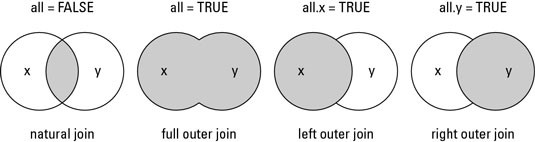

Stat545-HW04-Tidy-data-and-joins
================
Rachel Lobay
2018-10-02

Table of contents
=================

-   [Cheat sheet for tidyr functions](#cheat-sheet-for-tidyr-functions)
-   [Stop. How do we want to handle a data set in RStudio?](#stop-how-do-we-want-to-handle-a-data-set-in-rstudio)
-   [Quick refresher on dplyr](#quick-refresher-on-dplyr)
    -   [filter() and select() functions](#filter-and-select-functions)
        -   [select() function](#select-function)
        -   [filter() function](#filter-function)
    -   [Structure of tidyr](#structure-of-tidyr)
    -   [Tidyr gather() and spread() functions](#tidyr-gather-and-spread-functions)
        -   [gather() function](#gather-function)
        -   [spread() function](#spread-function)
        -   [Introducing the unite() function](#introducing-the-unite-function)
        -   [Introducing the separate() function](#introducing-the-separate-function)
-   [Cheatsheet for dplyr functions](#cheatsheet-for-dplyr-functions)
    -   [inner\_join(overpriced\_coffee\_shop\_menu, coffee\_brand)](#inner_joinoverpriced_coffee_shop_menu-coffee_brand)
    -   [semi\_join(overpriced\_coffee\_shop\_menu, coffee\_brand)](#semi_joinoverpriced_coffee_shop_menu-coffee_brand)
    -   [left\_join(overpriced\_coffee\_shop\_menu, coffee\_brand)](#left_joinoverpriced_coffee_shop_menu-coffee_brand)
    -   [right\_join(overpriced\_coffee\_shop\_menu, coffee\_brand)](#right_joinoverpriced_coffee_shop_menu-coffee_brand)
    -   [anti\_join(overpriced\_coffee\_shop\_menu, coffee\_brand)](#anti_joinoverpriced_coffee_shop_menu-coffee_brand)
    -   [inner\_join(coffee\_brand, overpriced\_coffee\_shop\_menu)](#inner_joincoffee_brand-overpriced_coffee_shop_menu)
    -   [semi\_join(coffee\_brand, overpriced\_coffee\_shop\_menu)](#semi_joincoffee_brand-overpriced_coffee_shop_menu)
    -   [left\_join(coffee\_brand, overpriced\_coffee\_shop\_menu)](#left_joincoffee_brand-overpriced_coffee_shop_menu)
    -   [anti\_join(coffee\_brand, overpriced\_coffee\_shop\_menu)](#anti_joincoffee_brand-overpriced_coffee_shop_menu)
    -   [full\_join(overpriced\_coffee\_shop\_menu, coffee\_brand)](#full_joinoverpriced_coffee_shop_menu-coffee_brand)
-   [Activity 3: Optional add-on to previous exercises](#activity-3-optional-add-on-to-previous-exercises)
    -   [Explore the base R function merge()](#explore-the-base-r-function-merge)
        -   [inner\_join vs corresponding merge function](#inner_join-vs-corresponding-merge-function)
        -   [full\_join vs corresponding merge function](#full_join-vs-corresponding-merge-function)
        -   [left\_join vs corresponding merge function](#left_join-vs-corresponding-merge-function)
        -   [right\_join vs corresponding merge function](#right_join-vs-corresponding-merge-function)
        -   [cross join and the lack of a dplyr equivalent](#cross-join-and-the-lack-of-a-dplyr-equivalent)
        -   [So are the dplyr join functions superior to the base R merge function?](#so-are-the-dplyr-join-functions-superior-to-the-base-r-merge-function)
    -   [Explore the base R function merge()](#explore-the-base-r-function-merge)
        -   [right\_join vs corresponding merge function](#right_join-vs-corresponding-merge-function)
        -   [cross join and the lack of a dplyr equivalent](#cross-join-and-the-lack-of-a-dplyr-equivalent)
        -   [So are the dplyr join functions superior to the base R merge function?](#so-are-the-dplyr-join-functions-superior-to-the-base-r-merge-function)
    -   [Explore the base R function match()](#explore-the-base-r-function-match)

Cheat sheet for tidyr functions
===============================

A very helpful RStudio cheat sheet on tidyr functions and data wrangling can be found [here](https://www.rstudio.com/wp-content/uploads/2015/02/data-wrangling-cheatsheet.pdf). Refer to that guide if you have any immediate questions. It will probably help :smile: My cheat sheet aims to be a highlight reel of that guide along with answering a few other interesting questions. Hence, I will use some of the images from the RStudio guide in my own cheat sheet.

Stop. How do we want to handle a data set in RStudio?
=====================================================

The below flow chart gives us an idea of how we want to handle a data set that we use in RStudio. We first want to import the data, tidy it, then do some data manipulations, transformations or modelling. Finally, we can relay our finished product to our targeted audience in a way that is easily accessible.


Ok. The flowchart seems pretty straight-forward. So, first I will load the packages that I will require for this assignment.

By loading the tidyverse package, we get a big bang for our buck because get that the ggplot2, dplyr, tidyr, and tibble packages are also loaded. I also will load the knitr package so we can make sleek tables pretty easily.

``` r
# I suppressed the messages that appear when I load the packages typing ```{r message=FALSE} at the top of this code block. 

library(tidyverse) # load tidyverse package
library(knitr) # for kable() function to make tables spiffy
```

I will use the cereal data set, which I downloaded from [here](https://gist.github.com/SinnerShanky/925f08febd10b40b8b5e). In this data set, there are 74 different types of breakfast cereals, their manufacturer (ie. Nabisco, Quaker Oats, Kellogs, Ralston Purina, General Mills, Post, and American Home Food Products), the calories, protein (g), fat, sodium, dietary fiber, carbs, sugars, display shelf (1, 2 or 3 beginning from the floor shelf), potassium, vitamins and minerals, serving size weight, and cups per serving. Also, I have attached the csv of this data set in my HW04 repo., just in case if it is not loading on Github.

``` r
cereal <- read_csv("https://gist.githubusercontent.com/SinnerShanky/925f08febd10b40b8b5e/raw/61013864f780e43a99349cc1e31fc89b39d862c0/cereal.csv") # read the csv in from the raw file on Github
```

    ## Parsed with column specification:
    ## cols(
    ##   `Cereal Name` = col_character(),
    ##   Manufacturer = col_character(),
    ##   Type = col_character(),
    ##   Calories = col_integer(),
    ##   `Protein (g)` = col_integer(),
    ##   Fat = col_integer(),
    ##   Sodium = col_integer(),
    ##   `Dietary Fiber` = col_double(),
    ##   Carbs = col_double(),
    ##   Sugars = col_integer(),
    ##   `Display Shelf` = col_integer(),
    ##   Potassium = col_integer(),
    ##   `Vitamins and Minerals` = col_integer(),
    ##   `Serving Size Weight` = col_double(),
    ##   `Cups per Serving` = col_double()
    ## )

Let's look at the top six rows of the cereal data set, to get an idea of what the data set looks like. Additionally, I will look at the dimensions of the data set to see if I would like to just look at a subset of the data.

``` r
head(cereal) # see top six rows of dataset. 
```

    ## # A tibble: 6 x 15
    ##   `Cereal Name` Manufacturer Type  Calories `Protein (g)`   Fat Sodium
    ##   <chr>         <chr>        <chr>    <int>         <int> <int>  <int>
    ## 1 100%_Bran     Nabisco      C           70             4     1    130
    ## 2 100%_Natural… Quaker Oats  C          120             3     5     15
    ## 3 All-Bran      Kelloggs     C           70             4     1    260
    ## 4 All-Bran_wit… Kelloggs     C           50             4     0    140
    ## 5 Almond_Delig… Ralston Pur… C          110             2     2    200
    ## 6 Apple_Cinnam… General Mil… C          110             2     2    180
    ## # ... with 8 more variables: `Dietary Fiber` <dbl>, Carbs <dbl>,
    ## #   Sugars <int>, `Display Shelf` <int>, Potassium <int>, `Vitamins and
    ## #   Minerals` <int>, `Serving Size Weight` <dbl>, `Cups per Serving` <dbl>

``` r
dim(cereal) # dimensions are 74 rows by 15 columns
```

    ## [1] 74 15

Since there are a lot of columns to deal with, to we will just use a subset of the data by selecting only the columns we require.

Quick refresher on dplyr
========================

filter() and select() functions
-------------------------------

In the dplyr() package, we have two handy tools to quickly and easily select certain rows or columns of a data frame.

### select() function


The function select() allows us to choose what columns we want from all the possible columns of our data.

**Example:**

We will look at the cereal data and select only the `Cereal Name`, Manufacturer, Calories, Sugars, Protein (g), Fat, and `Display Shelf` columns to keep our lives simple when we do further data manipulation and analysis.

``` r
# Let's use the cereal data to show the select function in action!

cereal_subset <- cereal %>% 
  select(`Cereal Name`, Manufacturer, Calories, Sugars, `Protein (g)`, Fat, `Display Shelf`) # say we just want to select the `Cereal Name`, Manufacturer, Calories, Sugars, Protein (g), Fat, and `Display Shelf` columns.
  
cereal_subset %>% 
  head() %>% # let's look at the top six rows of this subset of the chosen variables
  kable() # kable table it.
```

| Cereal Name                  | Manufacturer   |  Calories|  Sugars|  Protein (g)|  Fat|  Display Shelf|
|:-----------------------------|:---------------|---------:|-------:|------------:|----:|--------------:|
| 100%\_Bran                   | Nabisco        |        70|       6|            4|    1|              3|
| 100%\_Natural\_Bran          | Quaker Oats    |       120|       8|            3|    5|              3|
| All-Bran                     | Kelloggs       |        70|       5|            4|    1|              3|
| All-Bran\_with\_Extra\_Fiber | Kelloggs       |        50|       0|            4|    0|              3|
| Almond\_Delight              | Ralston Purina |       110|       8|            2|    2|              3|
| Apple\_Cinnamon\_Cheerios    | General Mills  |       110|      10|            2|    2|              1|

### filter() function


The function filter() is used to choose the desired rows of the data. For the cereal.subset data, suppose we are a cereal purist and only want the Nabisco cereals. Hence, we will filter the cereal.subset data just for the rows of Nabisco cereals in the next code block.

**Example:**

``` r
# Now let's see the filter() function in action!

cereal_subset_Nabisco <- cereal_subset %>% 
  filter(Manufacturer == "Nabisco") # filter for just the Nabisco cereals 

cereal_subset_Nabisco %>% 
  head() %>% # View top six rows to make sure we only got the Nabisco cereals
  kable() # kable table
```

| Cereal Name                  | Manufacturer |  Calories|  Sugars|  Protein (g)|  Fat|  Display Shelf|
|:-----------------------------|:-------------|---------:|-------:|------------:|----:|--------------:|
| 100%\_Bran                   | Nabisco      |        70|       6|            4|    1|              3|
| Cream\_of\_Wheat\_(Quick)    | Nabisco      |       100|       0|            3|    0|              2|
| Shredded\_Wheat              | Nabisco      |        80|       0|            2|    0|              1|
| Shredded\_Wheat\_'n'Bran     | Nabisco      |        90|       0|            3|    0|              1|
| Shredded\_Wheat\_spoon\_size | Nabisco      |        90|       0|            3|    0|              1|
| Strawberry\_Fruit\_Wheats    | Nabisco      |        90|       5|            2|    0|              2|

Structure of tidyr
------------------


The structure of tidyr is what you would expect. Variables are the column names, while elements (ie. observations) are put into the rows. No surprises here.

Tidyr gather() and spread() functions
-------------------------------------

This table which I adapted from [here](https://tidyr.tidyverse.org), provides a good translation of the terms gather and spread in the reshape2 package, spreadsheets and databases. The translations should help you to gain a intuitive feel for the functions.

| tidyr        | gather  | spread |
|--------------|---------|--------|
| reshape(2)   | melt    | cast   |
| spreadsheets | unpivot | pivot  |
| databases    | fold    | unfold |

Now, let's have a closer look at the structure of the gather() and spread() functions by talking about what exactly to put in the arguments. Note that the image below was obtained from [Tyler Rinker’s minimal guide to tidyr](https://github.com/trinker/tidyr_in_a_nutshell).


The above image explains that in the gather() function. When we use the gather() function, we get a key-value pair. The **key** is the name of a new column for the new variable, while the **value** is the name of the column which will contain values. The **...** refers to the columns that are included or excluded from gather().

The key-value pair is also used in the spread() function. For this function, the **key** is the column that we want to turn into multiple columns, while the **value** corresponds to the values that we want to turn into multiple column values.

### gather() function


The gather function takes data from a wide form and puts it into a long or tidy form. Think of the function as putting data from spreadsheet format into calculation format. The long form the function produces isn't the most visually-appealing, but it makes it easy to perform calculations and operate on the data.

**Example: **

We will put the Sugars, `Protein (g)` and Fat data (which were all measured in grams) into one column called Nutrients using the gather() function.

``` r
cereal_subset_Nabisco_long <- cereal_subset_Nabisco %>% 
  gather(key = "Nutrients", value = Values(g), 3:5) # put sugars, proteins and fat (all in g) of Nabisco cereals into one column called Nutrients

cereal_subset_Nabisco_long %>% # Let's see what happened!
  kable() # kable table it!
```

| Cereal Name                  | Manufacturer |  Fat|  Display Shelf| Nutrients   |  Values(g)|
|:-----------------------------|:-------------|----:|--------------:|:------------|----------:|
| 100%\_Bran                   | Nabisco      |    1|              3| Calories    |         70|
| Cream\_of\_Wheat\_(Quick)    | Nabisco      |    0|              2| Calories    |        100|
| Shredded\_Wheat              | Nabisco      |    0|              1| Calories    |         80|
| Shredded\_Wheat\_'n'Bran     | Nabisco      |    0|              1| Calories    |         90|
| Shredded\_Wheat\_spoon\_size | Nabisco      |    0|              1| Calories    |         90|
| Strawberry\_Fruit\_Wheats    | Nabisco      |    0|              2| Calories    |         90|
| 100%\_Bran                   | Nabisco      |    1|              3| Sugars      |          6|
| Cream\_of\_Wheat\_(Quick)    | Nabisco      |    0|              2| Sugars      |          0|
| Shredded\_Wheat              | Nabisco      |    0|              1| Sugars      |          0|
| Shredded\_Wheat\_'n'Bran     | Nabisco      |    0|              1| Sugars      |          0|
| Shredded\_Wheat\_spoon\_size | Nabisco      |    0|              1| Sugars      |          0|
| Strawberry\_Fruit\_Wheats    | Nabisco      |    0|              2| Sugars      |          5|
| 100%\_Bran                   | Nabisco      |    1|              3| Protein (g) |          4|
| Cream\_of\_Wheat\_(Quick)    | Nabisco      |    0|              2| Protein (g) |          3|
| Shredded\_Wheat              | Nabisco      |    0|              1| Protein (g) |          2|
| Shredded\_Wheat\_'n'Bran     | Nabisco      |    0|              1| Protein (g) |          3|
| Shredded\_Wheat\_spoon\_size | Nabisco      |    0|              1| Protein (g) |          3|
| Strawberry\_Fruit\_Wheats    | Nabisco      |    0|              2| Protein (g) |          2|

We should get the same output if we specify the columns as a range from 3:5 because columns 3 - 5 in the cereal.subset.Nabisco tibble are the sugars, proteins and fat columns.

``` r
cereal_subset_Nabisco_long2 <- cereal_subset_Nabisco %>% 
  gather(key = "Nutrients", value = Values(g), Sugars, `Protein (g)`, Fat)  # put sugars, proteins and fat (all in g) of Nabisco cereals into one column called Nutrients

cereal_subset_Nabisco_long2 %>% 
  kable() # kable table it!
```

| Cereal Name                  | Manufacturer |  Calories|  Display Shelf| Nutrients   |  Values(g)|
|:-----------------------------|:-------------|---------:|--------------:|:------------|----------:|
| 100%\_Bran                   | Nabisco      |        70|              3| Sugars      |          6|
| Cream\_of\_Wheat\_(Quick)    | Nabisco      |       100|              2| Sugars      |          0|
| Shredded\_Wheat              | Nabisco      |        80|              1| Sugars      |          0|
| Shredded\_Wheat\_'n'Bran     | Nabisco      |        90|              1| Sugars      |          0|
| Shredded\_Wheat\_spoon\_size | Nabisco      |        90|              1| Sugars      |          0|
| Strawberry\_Fruit\_Wheats    | Nabisco      |        90|              2| Sugars      |          5|
| 100%\_Bran                   | Nabisco      |        70|              3| Protein (g) |          4|
| Cream\_of\_Wheat\_(Quick)    | Nabisco      |       100|              2| Protein (g) |          3|
| Shredded\_Wheat              | Nabisco      |        80|              1| Protein (g) |          2|
| Shredded\_Wheat\_'n'Bran     | Nabisco      |        90|              1| Protein (g) |          3|
| Shredded\_Wheat\_spoon\_size | Nabisco      |        90|              1| Protein (g) |          3|
| Strawberry\_Fruit\_Wheats    | Nabisco      |        90|              2| Protein (g) |          2|
| 100%\_Bran                   | Nabisco      |        70|              3| Fat         |          1|
| Cream\_of\_Wheat\_(Quick)    | Nabisco      |       100|              2| Fat         |          0|
| Shredded\_Wheat              | Nabisco      |        80|              1| Fat         |          0|
| Shredded\_Wheat\_'n'Bran     | Nabisco      |        90|              1| Fat         |          0|
| Shredded\_Wheat\_spoon\_size | Nabisco      |        90|              1| Fat         |          0|
| Strawberry\_Fruit\_Wheats    | Nabisco      |        90|              2| Fat         |          0|

Booyah! We got the same output, so either way works.

**Example 2:**

Suppose an Australian and an American go shopping for breakfast cereal. So, we want the kilojoules (kJ) listed as energy measurments of the Nabisco cereals as well as the Calories. We can first create a new column with the kilojoules displayed using the mutate() function. Then, we will use the gather() function to make one column called Energy Measure that will have both the Calories and kilojoules of the cereals. So, the value column will containt the number of Calories and the number of kilojoules for each cereal. By using the gather function, the data frame is ready for calculations.

``` r
cereal_subset_Nabisco %>% 
  mutate(kilojoules = Calories * 4.184) %>%  # convert Calories to kilojoules by multiplying the calories by 4.184
  gather(key = "Energy Measurement", value = "Energy Count", Calories, kilojoules) %>% # gather Calories and kilojoules into a column called Energy Measurement and put their values in a column called Energy Count
  kable() # kable table it!
```

| Cereal Name                  | Manufacturer |  Sugars|  Protein (g)|  Fat|  Display Shelf| Energy Measurement |  Energy Count|
|:-----------------------------|:-------------|-------:|------------:|----:|--------------:|:-------------------|-------------:|
| 100%\_Bran                   | Nabisco      |       6|            4|    1|              3| Calories           |         70.00|
| Cream\_of\_Wheat\_(Quick)    | Nabisco      |       0|            3|    0|              2| Calories           |        100.00|
| Shredded\_Wheat              | Nabisco      |       0|            2|    0|              1| Calories           |         80.00|
| Shredded\_Wheat\_'n'Bran     | Nabisco      |       0|            3|    0|              1| Calories           |         90.00|
| Shredded\_Wheat\_spoon\_size | Nabisco      |       0|            3|    0|              1| Calories           |         90.00|
| Strawberry\_Fruit\_Wheats    | Nabisco      |       5|            2|    0|              2| Calories           |         90.00|
| 100%\_Bran                   | Nabisco      |       6|            4|    1|              3| kilojoules         |        292.88|
| Cream\_of\_Wheat\_(Quick)    | Nabisco      |       0|            3|    0|              2| kilojoules         |        418.40|
| Shredded\_Wheat              | Nabisco      |       0|            2|    0|              1| kilojoules         |        334.72|
| Shredded\_Wheat\_'n'Bran     | Nabisco      |       0|            3|    0|              1| kilojoules         |        376.56|
| Shredded\_Wheat\_spoon\_size | Nabisco      |       0|            3|    0|              1| kilojoules         |        376.56|
| Strawberry\_Fruit\_Wheats    | Nabisco      |       5|            2|    0|              2| kilojoules         |        376.56|

### spread() function

The spread function takes data from a long form and puts it into a wide form. Think of the function as putting data from calcuation format to speadsheet format. The wide form is more visually appealing. Hence, it would be useful for displaying data to your targeted audience on a website, in a book, or in an article.


**Example:**

One misleading way to to think of the spread function is that can "undo" the gather function. We must be careful with this line of thinking because the arrangement of the tibble columns may change when we try to "undo" the gather() function, which we will see in the example below. We will step into this trap and show that pitfall by trying to undo what we did with the gather function above to put the sugars, proteins and fat (all in g) of Nabisco cereals into one column called Nutrients.

Using the cereal.subset.Nabisco.long data and the spread() function, we will put the Fat, `Protein (g)`, and Sugars (which were all measured in grams) from the one column called Nutrients into each of their own columns.

``` r
cereal_subset_Nabisco_wide <- cereal_subset_Nabisco_long %>%
  spread(key = "Nutrients", value = "Values(g)") # puts the nutrients  Fat, `Protein (g)`, and Sugars each into their own columns

cereal_subset_Nabisco_wide %>% 
  kable() # kable table it!
```

| Cereal Name                  | Manufacturer |  Fat|  Display Shelf|  Calories|  Protein (g)|  Sugars|
|:-----------------------------|:-------------|----:|--------------:|---------:|------------:|-------:|
| 100%\_Bran                   | Nabisco      |    1|              3|        70|            4|       6|
| Cream\_of\_Wheat\_(Quick)    | Nabisco      |    0|              2|       100|            3|       0|
| Shredded\_Wheat              | Nabisco      |    0|              1|        80|            2|       0|
| Shredded\_Wheat\_'n'Bran     | Nabisco      |    0|              1|        90|            3|       0|
| Shredded\_Wheat\_spoon\_size | Nabisco      |    0|              1|        90|            3|       0|
| Strawberry\_Fruit\_Wheats    | Nabisco      |    0|              2|        90|            2|       5|

So, the Nutrients column has now been split back into the Fat, `Protein (g)`, and Sugars columns as we originally had. Note that the order of the columns is now different. It makes sense that the appears that the Fat, `Protein (g)`, and Sugars columns appeared after the `Display Shelf` column because the Nutrients column was after the `Display Shelf` column in the cereal.subset.Nabisco.long tibble. Also, observe that the columns Fat, `Protein (g)`, and Sugars have been sorted alphabetically in the new cereal.subset.Nabisco.wide tibble. We don't have the original order Sugars, `Protein (g)` and Fat that we had in the cereal.subset.Nabisco tibble.

### Introducing the unite() function

We can combine the data from two variables by using the unite() function.

**Example:**

First, we will arrange the Manufacturer\_Shelf column in descending order (ie. top to bottom shelf) by using the dplyr function arrange(). Then, let's unite the columns of Manufacturer and Display Shelf to investigate which manufacturers get top-shelf and bottom-shelf priority.

``` r
manuf_shelf_subset <- cereal_subset %>% 
  arrange(desc(`Display Shelf`)) %>%  # arrange from top to bottom shelf
  unite(Manufacturer_Shelf, Manufacturer, `Display Shelf`) 

# peak at the head of the manuf.shelf.subset 
head(manuf_shelf_subset) %>% 
  kable() # kable table of head of data
```

| Cereal Name                  | Manufacturer\_Shelf |  Calories|  Sugars|  Protein (g)|  Fat|
|:-----------------------------|:--------------------|---------:|-------:|------------:|----:|
| 100%\_Bran                   | Nabisco\_3          |        70|       6|            4|    1|
| 100%\_Natural\_Bran          | Quaker Oats\_3      |       120|       8|            3|    5|
| All-Bran                     | Kelloggs\_3         |        70|       5|            4|    1|
| All-Bran\_with\_Extra\_Fiber | Kelloggs\_3         |        50|       0|            4|    0|
| Almond\_Delight              | Ralston Purina\_3   |       110|       8|            2|    2|
| Basic\_4                     | General Mills\_3    |       130|       8|            3|    2|

Excellent. The top few rows (that have MANUFACTURERNAME\_3) are from the top shelf.

Now, let's check that the bottom few rows of the data to see that the brands are on the first shelf.

``` r
tail(manuf_shelf_subset) %>% 
  kable() # kable table of tail of data
```

| Cereal Name                  | Manufacturer\_Shelf |  Calories|  Sugars|  Protein (g)|  Fat|
|:-----------------------------|:--------------------|---------:|-------:|------------:|----:|
| Shredded\_Wheat\_'n'Bran     | Nabisco\_1          |        90|       0|            3|    0|
| Shredded\_Wheat\_spoon\_size | Nabisco\_1          |        90|       0|            3|    0|
| Special\_K                   | Kelloggs\_1         |       110|       3|            6|    0|
| Wheat\_Chex                  | Ralston Purina\_1   |       100|       3|            3|    1|
| Wheaties                     | General Mills\_1    |       100|       3|            3|    1|
| Wheaties\_Honey\_Gold        | General Mills\_1    |       110|       8|            2|    1|

The tail table is looking good. Now, we should check the whole data set to make sure it runs from the top shelf to the bottom shelf, but I will leave that as a tedious exercise to the reader.

What we want to look for from the outputs if one particular manufacturer has top shelf, middle shelf or bottom shelf priority.

``` r
table_manuf_shelf <- table(manuf_shelf_subset$Manufacturer_Shelf) # quick look at the count of the cereal on shelf distribution

table_manuf_shelf[order(table_manuf_shelf)] %>% # order from lowest to highest count
  kable() # kable table it!
```

| Var1                           |  Freq|
|:-------------------------------|-----:|
| American Home Food Products\_2 |     1|
| Nabisco\_3                     |     1|
| Post\_2                        |     1|
| Quaker Oats\_1                 |     1|
| Nabisco\_2                     |     2|
| Post\_1                        |     2|
| Ralston Purina\_3              |     2|
| Nabisco\_1                     |     3|
| Quaker Oats\_2                 |     3|
| Kelloggs\_1                    |     4|
| Quaker Oats\_3                 |     4|
| Ralston Purina\_1              |     4|
| Post\_3                        |     5|
| General Mills\_1               |     6|
| General Mills\_2               |     7|
| Kelloggs\_2                    |     7|
| General Mills\_3               |     9|
| Kelloggs\_3                    |    12|

From our quick inspection of the data, it appears that Kellogs has top-shelf priority as it has 12 cereals on the top shelf. General Mills is not too far behind with 9 cereals on the top shelf. As far as bottom shelf priority, Generall Mills wins with 6 cereals on the bottom shelf. Perhaps General Mills produces a lot of children's cereal, so certain children-targeted breakfast cereals are put within easy reach on the bottom shelf. This is pure speculation, but it is good to try to reason why the data is the way it is.

### Introducing the separate() function

The separate function does what it claims to do - it splits one column into multiple columns. It is the complement of the unite() function in tidyr.

**Example:**

A complementary example to our separate function example would be to try to separate the manufacturer and shelf column into separate columns. Let's try this below!

``` r
manuf_shelf_subset %>% 
  separate(Manufacturer_Shelf, c("Manufacturer", "Shelf"), sep = "_") %>% # split the Manufacturer_Shelf column at the underscore
  kable() # kable table for neater output!
```

| Cereal Name                     | Manufacturer                | Shelf |  Calories|  Sugars|  Protein (g)|  Fat|
|:--------------------------------|:----------------------------|:------|---------:|-------:|------------:|----:|
| 100%\_Bran                      | Nabisco                     | 3     |        70|       6|            4|    1|
| 100%\_Natural\_Bran             | Quaker Oats                 | 3     |       120|       8|            3|    5|
| All-Bran                        | Kelloggs                    | 3     |        70|       5|            4|    1|
| All-Bran\_with\_Extra\_Fiber    | Kelloggs                    | 3     |        50|       0|            4|    0|
| Almond\_Delight                 | Ralston Purina              | 3     |       110|       8|            2|    2|
| Basic\_4                        | General Mills               | 3     |       130|       8|            3|    2|
| Bran\_Flakes                    | Post                        | 3     |        90|       5|            3|    0|
| Clusters                        | General Mills               | 3     |       110|       7|            3|    2|
| Cracklin'\_Oat\_Bran            | Kelloggs                    | 3     |       110|       7|            3|    3|
| Crispix                         | Kelloggs                    | 3     |       110|       3|            2|    0|
| Crispy\_Wheat\_&\_Raisins       | General Mills               | 3     |       100|      10|            2|    1|
| Double\_Chex                    | Ralston Purina              | 3     |       100|       5|            2|    0|
| Fruitful\_Bran                  | Kelloggs                    | 3     |       120|      12|            3|    0|
| Grape\_Nuts\_Flakes             | Post                        | 3     |       100|       5|            3|    1|
| Grape-Nuts                      | Post                        | 3     |       110|       3|            3|    0|
| Great\_Grains\_Pecan            | Post                        | 3     |       120|       4|            3|    3|
| Just\_Right\_Crunchy\_\_Nuggets | Kelloggs                    | 3     |       110|       6|            2|    1|
| Just\_Right\_Fruit\_&\_Nut      | Kelloggs                    | 3     |       140|       9|            3|    1|
| Mueslix\_Crispy\_Blend          | Kelloggs                    | 3     |       160|      13|            3|    2|
| Nutri-Grain\_Almond-Raisin      | Kelloggs                    | 3     |       140|       7|            3|    2|
| Nutri-grain\_Wheat              | Kelloggs                    | 3     |        90|       2|            3|    0|
| Oatmeal\_Raisin\_Crisp          | General Mills               | 3     |       130|      10|            3|    2|
| Post\_Nat.\_Raisin\_Bran        | Post                        | 3     |       120|      14|            3|    1|
| Product\_19                     | Kelloggs                    | 3     |       100|       3|            3|    0|
| Puffed\_Rice                    | Quaker Oats                 | 3     |        50|       0|            1|    0|
| Puffed\_Wheat                   | Quaker Oats                 | 3     |        50|       0|            2|    0|
| Quaker\_Oat\_Squares            | Quaker Oats                 | 3     |       100|       6|            4|    1|
| Raisin\_Nut\_Bran               | General Mills               | 3     |       100|       8|            3|    2|
| Raisin\_Squares                 | Kelloggs                    | 3     |        90|       6|            2|    0|
| Total\_Corn\_Flakes             | General Mills               | 3     |       110|       3|            2|    1|
| Total\_Raisin\_Bran             | General Mills               | 3     |       140|      14|            3|    1|
| Total\_Whole\_Grain             | General Mills               | 3     |       100|       3|            3|    1|
| Triples                         | General Mills               | 3     |       110|       3|            2|    1|
| Apple\_Jacks                    | Kelloggs                    | 2     |       110|      14|            2|    0|
| Cap'n'Crunch                    | Quaker Oats                 | 2     |       120|      12|            1|    2|
| Cinnamon\_Toast\_Crunch         | General Mills               | 2     |       120|       9|            1|    3|
| Cocoa\_Puffs                    | General Mills               | 2     |       110|      13|            1|    1|
| Corn\_Pops                      | Kelloggs                    | 2     |       110|      12|            1|    0|
| Count\_Chocula                  | General Mills               | 2     |       110|      13|            1|    1|
| Cream\_of\_Wheat\_(Quick)       | Nabisco                     | 2     |       100|       0|            3|    0|
| Froot\_Loops                    | Kelloggs                    | 2     |       110|      13|            2|    1|
| Frosted\_Mini-Wheats            | Kelloggs                    | 2     |       100|       7|            3|    0|
| Fruity\_Pebbles                 | Post                        | 2     |       110|      12|            1|    1|
| Golden\_Grahams                 | General Mills               | 2     |       110|       9|            1|    1|
| Honey\_Graham\_Ohs              | Quaker Oats                 | 2     |       120|      11|            1|    2|
| Kix                             | General Mills               | 2     |       110|       3|            2|    1|
| Life                            | Quaker Oats                 | 2     |       100|       6|            4|    2|
| Lucky\_Charms                   | General Mills               | 2     |       110|      12|            2|    1|
| Maypo                           | American Home Food Products | 2     |       100|       3|            4|    1|
| Nut&Honey\_Crunch               | Kelloggs                    | 2     |       120|       9|            2|    1|
| Raisin\_Bran                    | Kelloggs                    | 2     |       120|      12|            3|    1|
| Smacks                          | Kelloggs                    | 2     |       110|      15|            2|    1|
| Strawberry\_Fruit\_Wheats       | Nabisco                     | 2     |        90|       5|            2|    0|
| Trix                            | General Mills               | 2     |       110|      12|            1|    1|
| Apple\_Cinnamon\_Cheerios       | General Mills               | 1     |       110|      10|            2|    2|
| Bran\_Chex                      | Ralston Purina              | 1     |        90|       6|            2|    1|
| Cheerios                        | General Mills               | 1     |       110|       1|            6|    2|
| Corn\_Chex                      | Ralston Purina              | 1     |       110|       3|            2|    0|
| Corn\_Flakes                    | Kelloggs                    | 1     |       100|       2|            2|    0|
| Frosted\_Flakes                 | Kelloggs                    | 1     |       110|      11|            1|    0|
| Golden\_Crisp                   | Post                        | 1     |       100|      15|            2|    0|
| Honey\_Nut\_Cheerios            | General Mills               | 1     |       110|      10|            3|    1|
| Honey-comb                      | Post                        | 1     |       110|      11|            1|    0|
| Multi-Grain\_Cheerios           | General Mills               | 1     |       100|       6|            2|    1|
| Quaker\_Oatmeal                 | Quaker Oats                 | 1     |       100|      -1|            5|    2|
| Rice\_Chex                      | Ralston Purina              | 1     |       110|       2|            1|    0|
| Rice\_Krispies                  | Kelloggs                    | 1     |       110|       3|            2|    0|
| Shredded\_Wheat                 | Nabisco                     | 1     |        80|       0|            2|    0|
| Shredded\_Wheat\_'n'Bran        | Nabisco                     | 1     |        90|       0|            3|    0|
| Shredded\_Wheat\_spoon\_size    | Nabisco                     | 1     |        90|       0|            3|    0|
| Special\_K                      | Kelloggs                    | 1     |       110|       3|            6|    0|
| Wheat\_Chex                     | Ralston Purina              | 1     |       100|       3|            3|    1|
| Wheaties                        | General Mills               | 1     |       100|       3|            3|    1|
| Wheaties\_Honey\_Gold           | General Mills               | 1     |       110|       8|            2|    1|

Note that we must specify the underscore here to separate the Manufacturer\_Shelf column. If we do not specify that, what happens?

``` r
# Pitfall below
manuf_shelf_subset %>% 
  separate(Manufacturer_Shelf, c("Manufacturer", "Shelf")) %>% # separate without sep argument specified to be _
  kable() # kable table it!
```

    ## Warning: Expected 2 pieces. Additional pieces discarded in 37 rows [2, 5,
    ## 6, 8, 11, 12, 22, 25, 26, 27, 28, 30, 31, 32, 33, 35, 36, 37, 39, 44, ...].

| Cereal Name                     | Manufacturer | Shelf  |  Calories|  Sugars|  Protein (g)|  Fat|
|:--------------------------------|:-------------|:-------|---------:|-------:|------------:|----:|
| 100%\_Bran                      | Nabisco      | 3      |        70|       6|            4|    1|
| 100%\_Natural\_Bran             | Quaker       | Oats   |       120|       8|            3|    5|
| All-Bran                        | Kelloggs     | 3      |        70|       5|            4|    1|
| All-Bran\_with\_Extra\_Fiber    | Kelloggs     | 3      |        50|       0|            4|    0|
| Almond\_Delight                 | Ralston      | Purina |       110|       8|            2|    2|
| Basic\_4                        | General      | Mills  |       130|       8|            3|    2|
| Bran\_Flakes                    | Post         | 3      |        90|       5|            3|    0|
| Clusters                        | General      | Mills  |       110|       7|            3|    2|
| Cracklin'\_Oat\_Bran            | Kelloggs     | 3      |       110|       7|            3|    3|
| Crispix                         | Kelloggs     | 3      |       110|       3|            2|    0|
| Crispy\_Wheat\_&\_Raisins       | General      | Mills  |       100|      10|            2|    1|
| Double\_Chex                    | Ralston      | Purina |       100|       5|            2|    0|
| Fruitful\_Bran                  | Kelloggs     | 3      |       120|      12|            3|    0|
| Grape\_Nuts\_Flakes             | Post         | 3      |       100|       5|            3|    1|
| Grape-Nuts                      | Post         | 3      |       110|       3|            3|    0|
| Great\_Grains\_Pecan            | Post         | 3      |       120|       4|            3|    3|
| Just\_Right\_Crunchy\_\_Nuggets | Kelloggs     | 3      |       110|       6|            2|    1|
| Just\_Right\_Fruit\_&\_Nut      | Kelloggs     | 3      |       140|       9|            3|    1|
| Mueslix\_Crispy\_Blend          | Kelloggs     | 3      |       160|      13|            3|    2|
| Nutri-Grain\_Almond-Raisin      | Kelloggs     | 3      |       140|       7|            3|    2|
| Nutri-grain\_Wheat              | Kelloggs     | 3      |        90|       2|            3|    0|
| Oatmeal\_Raisin\_Crisp          | General      | Mills  |       130|      10|            3|    2|
| Post\_Nat.\_Raisin\_Bran        | Post         | 3      |       120|      14|            3|    1|
| Product\_19                     | Kelloggs     | 3      |       100|       3|            3|    0|
| Puffed\_Rice                    | Quaker       | Oats   |        50|       0|            1|    0|
| Puffed\_Wheat                   | Quaker       | Oats   |        50|       0|            2|    0|
| Quaker\_Oat\_Squares            | Quaker       | Oats   |       100|       6|            4|    1|
| Raisin\_Nut\_Bran               | General      | Mills  |       100|       8|            3|    2|
| Raisin\_Squares                 | Kelloggs     | 3      |        90|       6|            2|    0|
| Total\_Corn\_Flakes             | General      | Mills  |       110|       3|            2|    1|
| Total\_Raisin\_Bran             | General      | Mills  |       140|      14|            3|    1|
| Total\_Whole\_Grain             | General      | Mills  |       100|       3|            3|    1|
| Triples                         | General      | Mills  |       110|       3|            2|    1|
| Apple\_Jacks                    | Kelloggs     | 2      |       110|      14|            2|    0|
| Cap'n'Crunch                    | Quaker       | Oats   |       120|      12|            1|    2|
| Cinnamon\_Toast\_Crunch         | General      | Mills  |       120|       9|            1|    3|
| Cocoa\_Puffs                    | General      | Mills  |       110|      13|            1|    1|
| Corn\_Pops                      | Kelloggs     | 2      |       110|      12|            1|    0|
| Count\_Chocula                  | General      | Mills  |       110|      13|            1|    1|
| Cream\_of\_Wheat\_(Quick)       | Nabisco      | 2      |       100|       0|            3|    0|
| Froot\_Loops                    | Kelloggs     | 2      |       110|      13|            2|    1|
| Frosted\_Mini-Wheats            | Kelloggs     | 2      |       100|       7|            3|    0|
| Fruity\_Pebbles                 | Post         | 2      |       110|      12|            1|    1|
| Golden\_Grahams                 | General      | Mills  |       110|       9|            1|    1|
| Honey\_Graham\_Ohs              | Quaker       | Oats   |       120|      11|            1|    2|
| Kix                             | General      | Mills  |       110|       3|            2|    1|
| Life                            | Quaker       | Oats   |       100|       6|            4|    2|
| Lucky\_Charms                   | General      | Mills  |       110|      12|            2|    1|
| Maypo                           | American     | Home   |       100|       3|            4|    1|
| Nut&Honey\_Crunch               | Kelloggs     | 2      |       120|       9|            2|    1|
| Raisin\_Bran                    | Kelloggs     | 2      |       120|      12|            3|    1|
| Smacks                          | Kelloggs     | 2      |       110|      15|            2|    1|
| Strawberry\_Fruit\_Wheats       | Nabisco      | 2      |        90|       5|            2|    0|
| Trix                            | General      | Mills  |       110|      12|            1|    1|
| Apple\_Cinnamon\_Cheerios       | General      | Mills  |       110|      10|            2|    2|
| Bran\_Chex                      | Ralston      | Purina |        90|       6|            2|    1|
| Cheerios                        | General      | Mills  |       110|       1|            6|    2|
| Corn\_Chex                      | Ralston      | Purina |       110|       3|            2|    0|
| Corn\_Flakes                    | Kelloggs     | 1      |       100|       2|            2|    0|
| Frosted\_Flakes                 | Kelloggs     | 1      |       110|      11|            1|    0|
| Golden\_Crisp                   | Post         | 1      |       100|      15|            2|    0|
| Honey\_Nut\_Cheerios            | General      | Mills  |       110|      10|            3|    1|
| Honey-comb                      | Post         | 1      |       110|      11|            1|    0|
| Multi-Grain\_Cheerios           | General      | Mills  |       100|       6|            2|    1|
| Quaker\_Oatmeal                 | Quaker       | Oats   |       100|      -1|            5|    2|
| Rice\_Chex                      | Ralston      | Purina |       110|       2|            1|    0|
| Rice\_Krispies                  | Kelloggs     | 1      |       110|       3|            2|    0|
| Shredded\_Wheat                 | Nabisco      | 1      |        80|       0|            2|    0|
| Shredded\_Wheat\_'n'Bran        | Nabisco      | 1      |        90|       0|            3|    0|
| Shredded\_Wheat\_spoon\_size    | Nabisco      | 1      |        90|       0|            3|    0|
| Special\_K                      | Kelloggs     | 1      |       110|       3|            6|    0|
| Wheat\_Chex                     | Ralston      | Purina |       100|       3|            3|    1|
| Wheaties                        | General      | Mills  |       100|       3|            3|    1|
| Wheaties\_Honey\_Gold           | General      | Mills  |       110|       8|            2|    1|

Troublesome. We see that when we didn't specify `sep = "_"`in separate, then it looks like the function sometimes separates by the space and, when there is no space in the manufacturer name, it separates by the underscore.

I looked [here](https://www.rdocumentation.org/packages/tidyr/versions/0.8.1/topics/separate) to try find what specifically the sep argument separates by and here is what I found from that RDocumentation:

> "The default value is a regular expression that matches any sequence of non-alphanumeric values."

So, that answers it. Any sequence of non-alphanumeric values, such as a space or underscore, is the default sep value. It just depends on what R recognizes first to be a non-alphanumeric value.

Cheatsheet for dplyr functions
==============================

We already loded the tidyverse package above, so I will not load that again. If we didn't load the tidyverse package above, we should load it so we could access the dplyr package.

So, I will start by constructing a menu for an overpriced coffee shop. This bare-bones menu will contain the name of the drink, the drink type (espresso-based, caffinated drip coffee, or tea), and the pricey price ($) of the drink.

``` r
overpriced_coffee_shop_menu <- "
    name, drink_type, price ($)
 latte, espresso-based, 6.00
   cappuccino, espresso-based, 6.00
americano, espresso-based, 5.00
  cafe_mocha, espresso-based, 6.50
ice_coffee, caffinated drip coffee, 4.00
 plain_ol_coffee, caffinated drip coffee, 4.00
cuppa_tea, tea, 3.00
"

overpriced_coffee_shop_menu <- read_csv(overpriced_coffee_shop_menu, skip = 1)

overpriced_coffee_shop_menu$`price ($)` <- formatC(overpriced_coffee_shop_menu$`price ($)`, format = 'f', flag='0', digits = 2) # make sure price_in_dollars is to two decimal places

overpriced_coffee_shop_menu %>% 
  kable() # Let's see the overpriced coffee shop menu in kable table form!
```

| name              | drink\_type            | price ($) |
|:------------------|:-----------------------|:----------|
| latte             | espresso-based         | 6.00      |
| cappuccino        | espresso-based         | 6.00      |
| americano         | espresso-based         | 5.00      |
| cafe\_mocha       | espresso-based         | 6.50      |
| ice\_coffee       | caffinated drip coffee | 4.00      |
| plain\_ol\_coffee | caffinated drip coffee | 4.00      |
| cuppa\_tea        | tea                    | 3.00      |

Next, I will construct a csv for the drink brand for the three drink types, espress-based, tea, and drip coffee.

``` r
coffee_brand <- "
    drink_type, brand
    espresso-based, Lavazza Super Crema
    caffinated drip coffee, Kicking Horse Coffee
    decaf drip coffee, Maxwell House
"

coffee_brand <- read_csv(coffee_brand, skip = 1)

coffee_brand %>% 
  kable() # Let's see the coffee brand table in kable form!
```

| drink\_type            | brand                |
|:-----------------------|:---------------------|
| espresso-based         | Lavazza Super Crema  |
| caffinated drip coffee | Kicking Horse Coffee |
| decaf drip coffee      | Maxwell House        |

You will observe that my cheatsheet is structured and patterened after [Jenny's cheatsheet](http://stat545.com/bit001_dplyr-cheatsheet.html). Also, note that the definitions I will refer to for each of the join functions are from [here](https://dplyr.tidyverse.org/reference/join.html).

inner\_join(overpriced\_coffee\_shop\_menu, coffee\_brand)
----------------------------------------------------------

 

> inner\_join(x, y): Return all rows from x where there are matching values in y, and all columns from x and y. If there are multiple matches between x and y, all combination of the matches are returned. This is a mutating join.

``` r
(ij_csm_cb <- inner_join(overpriced_coffee_shop_menu, coffee_brand)) # use the inner_join function to join the two tibbles and show output
```

    ## Joining, by = "drink_type"

    ## # A tibble: 6 x 4
    ##   name            drink_type             `price ($)` brand               
    ##   <chr>           <chr>                  <chr>       <chr>               
    ## 1 latte           espresso-based         6.00        Lavazza Super Crema 
    ## 2 cappuccino      espresso-based         6.00        Lavazza Super Crema 
    ## 3 americano       espresso-based         5.00        Lavazza Super Crema 
    ## 4 cafe_mocha      espresso-based         6.50        Lavazza Super Crema 
    ## 5 ice_coffee      caffinated drip coffee 4.00        Kicking Horse Coffee
    ## 6 plain_ol_coffee caffinated drip coffee 4.00        Kicking Horse Coffee

We can see that the function automatically joins by "coffee\_type". That is because the common variable between both of the tibbles is drink\_type.

Notice that when we use the inner\_join function, we miss the tea brand because the tea brand was not included in the coffee\_type tibble. Additionally, we can see that we get all the variables from both tibbles when we use the inner\_join function.

semi\_join(overpriced\_coffee\_shop\_menu, coffee\_brand)
---------------------------------------------------------

 

> semi\_join(x, y): Return all rows from x where there are matching values in y, keeping just columns from x. A semi join differs from an inner join because an inner join will return one row of x for each matching row of y, where a semi join will never duplicate rows of x. This is a filtering join.

``` r
(sj_csm_cb <- semi_join(overpriced_coffee_shop_menu, coffee_brand)) # use the semi_join function to join the two tibbles and show output
```

    ## Joining, by = "drink_type"

    ## # A tibble: 6 x 3
    ##   name            drink_type             `price ($)`
    ##   <chr>           <chr>                  <chr>      
    ## 1 latte           espresso-based         6.00       
    ## 2 cappuccino      espresso-based         6.00       
    ## 3 americano       espresso-based         5.00       
    ## 4 cafe_mocha      espresso-based         6.50       
    ## 5 ice_coffee      caffinated drip coffee 4.00       
    ## 6 plain_ol_coffee caffinated drip coffee 4.00

As we had with the inner\_join function, we can see that the semi\_joinfunction automatically joins by "coffee\_type". That is because the common variable between both of the tibbles is drink\_type.

Notice that the resulting tibble only contains the variables that we had in overpriced\_coffee\_shop\_menu tibble and not the additional varaibles from the coffee\_brand tibble.

We can easily see the difference between the tibbles resulting from the semi\_join function and the inner\_join function by looking at a side-by-side comparison of them.

I will load the gridExtra package to display the tables side-by-side. Note that in order to use the grid.arrange() function on the two tables, I first had to convert them each to tableGrob. The left is the semi\_join function result, while the right is the inner\_join function result. I couldn't find a quick way to add a title to each tableGrob. I think that revealed one of the drawbacks of usign a tableGrob. Now, the code I used to add a title to each tableGrob was found [here](https://stackoverflow.com/questions/31640916/how-can-i-add-a-title-to-a-tablegrob-plot).

``` r
library(gridExtra) # load gridExtra package 
```

    ## 
    ## Attaching package: 'gridExtra'

    ## The following object is masked from 'package:dplyr':
    ## 
    ##     combine

``` r
library(grid) # load grid package to use textGrob() function to add titles to table (for example, I used function textGrob() from this package)
library(gtable) # load gtable package to add titles to tables (for example, I used functions gtable_add_rows() and gtable_add_grob() from this package).


sj_Grobtable <- tableGrob(sj_csm_cb, theme=ttheme_default(
    core = list(fg_params=list(cex = 0.55)), # smaller table text size
    colhead = list(fg_params=list(cex = 0.55)), 
    rowhead = list(fg_params=list(cex = 0.55)), rows=NULL))  # transform sjcsm into a tableGrob

# add title to sj_Grobtable
title <- textGrob("semi_join function result", gp = gpar(fontsize = 10))
padding <- unit(0.5,"line")
sj_Grobtable <- gtable_add_rows(
  sj_Grobtable, heights = grobHeight(title) + padding, pos = 0
)
sj_Grobtable <- gtable_add_grob(
  sj_Grobtable, list(title),
  t = 1, l = 1, r = ncol(sj_Grobtable)
)


ij_Grobtable <- tableGrob(ij_csm_cb, theme=ttheme_default(
    core = list(fg_params=list(cex = 0.55)), # smaller table text size
    colhead = list(fg_params=list(cex = 0.55)), 
    rowhead = list(fg_params=list(cex = 0.55)), rows=NULL))  # transform ijcsm into a tableGrob

# add title to ij_Grobtable
title <- textGrob("inner_join function result", gp = gpar(fontsize = 10))
padding <- unit(0.5,"line")
ij_Grobtable <- gtable_add_rows(
  ij_Grobtable, heights = grobHeight(title) + padding, pos = 0
)
ij_Grobtable <- gtable_add_grob(
  ij_Grobtable, list(title),
  t = 1, l = 1, r = ncol(ij_Grobtable)
)


grid.arrange(sj_Grobtable, ij_Grobtable, nrow=1) # display tables side-by-side
```


left\_join(overpriced\_coffee\_shop\_menu, coffee\_brand)
---------------------------------------------------------

 

> left\_join(x, y): Return all rows from x, and all columns from x and y. If there are multiple matches between x and y, all combination of the matches are returned. This is a mutating join.

``` r
(lj_csm_cb <- left_join(overpriced_coffee_shop_menu, coffee_brand)) # use the left_join function to join the two tibbles and show output
```

    ## Joining, by = "drink_type"

    ## # A tibble: 7 x 4
    ##   name            drink_type             `price ($)` brand               
    ##   <chr>           <chr>                  <chr>       <chr>               
    ## 1 latte           espresso-based         6.00        Lavazza Super Crema 
    ## 2 cappuccino      espresso-based         6.00        Lavazza Super Crema 
    ## 3 americano       espresso-based         5.00        Lavazza Super Crema 
    ## 4 cafe_mocha      espresso-based         6.50        Lavazza Super Crema 
    ## 5 ice_coffee      caffinated drip coffee 4.00        Kicking Horse Coffee
    ## 6 plain_ol_coffee caffinated drip coffee 4.00        Kicking Horse Coffee
    ## 7 cuppa_tea       tea                    3.00        <NA>

Using left\_join(overpriced\_coffee\_shop\_menu, coffee\_brand), what we get is the overpriced\_coffee\_shop\_menu, but with the addition of the brand column. Also, we can see that cuppa\_tea, which did not have a brand in the coffee\_brand tibble, has an NA for its brand.

right\_join(overpriced\_coffee\_shop\_menu, coffee\_brand)
----------------------------------------------------------

 

> right\_join(x, y): Return all rows from y, and all columns from x and y. Rows in y with no match in x will have NA values in the new columns. If there are multiple matches between x and y, all combinations of the matches are returned.

``` r
(rj_csm_cb <- right_join(overpriced_coffee_shop_menu, coffee_brand)) # use the right_join function to join the two tibbles and show output
```

    ## Joining, by = "drink_type"

    ## # A tibble: 7 x 4
    ##   name            drink_type             `price ($)` brand               
    ##   <chr>           <chr>                  <chr>       <chr>               
    ## 1 latte           espresso-based         6.00        Lavazza Super Crema 
    ## 2 cappuccino      espresso-based         6.00        Lavazza Super Crema 
    ## 3 americano       espresso-based         5.00        Lavazza Super Crema 
    ## 4 cafe_mocha      espresso-based         6.50        Lavazza Super Crema 
    ## 5 ice_coffee      caffinated drip coffee 4.00        Kicking Horse Coffee
    ## 6 plain_ol_coffee caffinated drip coffee 4.00        Kicking Horse Coffee
    ## 7 <NA>            decaf drip coffee      <NA>        Maxwell House

Using right\_join(overpriced\_coffee\_shop\_menu, coffee\_brand), what we are doing is returning all the rows from coffee\_brand and all the columns from overpriced\_coffee\_shop\_menu and coffee\_brand. Hence, om the output, we can see that we now just have the six coffee drinks and no cuppa\_tea row because cuppa\_tea did not have a row listed in the coffee\_brand tibble.

I will display the left\_join function result and the right\_join function result side-by-side for easy comparison. Again, I will use the grobTable to achieve this. The left\_join function result will be on the left, while the right\_join function result will be on the right. Also, note that I hid the code because it is basically the same as when we looked at semi\_join and inner\_join side-by-side. I will hide the code in future examples if it is basically the same as previous code blocks.


From the side-by-side comparison of the left\_join and right\_join function results, we can see that the only difference is that right\_join does not have the cuppa\_tea row in its output, whereas left\_join does have that row in its output.

anti\_join(overpriced\_coffee\_shop\_menu, coffee\_brand)
---------------------------------------------------------

 

> anti\_join(x, y): Return all rows from x where there are not matching values in y, keeping just columns from x. This is a filtering join.

``` r
(aj_csm_cb <- anti_join(overpriced_coffee_shop_menu, coffee_brand)) # use the anti_join function to join the two tibbles and show output
```

    ## Joining, by = "drink_type"

    ## # A tibble: 1 x 3
    ##   name      drink_type `price ($)`
    ##   <chr>     <chr>      <chr>      
    ## 1 cuppa_tea tea        3.00

We can see from the anti\_join function output that the only row the overpriced\_coffee\_shop\_menu tibble where there is nomatching values in coffee\_brand is the tea row. Hence, the tea row was the only row in the output (with its column values for drink\_type and `price ($)` from overpriced\_coffee\_shop\_menu).

I will aim to show this clearly by displaying the original tables of overpriced\_coffee\_shop\_menu and coffee\_brand close to the anti\_join reslt for you to see the impact of the anti\_join function. Note I did not put all three tables side-by-side, because the tables overlap when we use tableGrob and the grid.arrange() functions.


inner\_join(coffee\_brand, overpriced\_coffee\_shop\_menu)
----------------------------------------------------------

 

> inner\_join(x, y): Return all rows from x where there are matching values in y, and all columns from x and y. If there are multiple matches between x and y, all combination of the matches are returned. This is a mutating join.

``` r
(ij_cb_csm <- inner_join(coffee_brand, overpriced_coffee_shop_menu)) # use the inner_join function to join the two tibbles and show output
```

    ## Joining, by = "drink_type"

    ## # A tibble: 6 x 4
    ##   drink_type             brand                name            `price ($)`
    ##   <chr>                  <chr>                <chr>           <chr>      
    ## 1 espresso-based         Lavazza Super Crema  latte           6.00       
    ## 2 espresso-based         Lavazza Super Crema  cappuccino      6.00       
    ## 3 espresso-based         Lavazza Super Crema  americano       5.00       
    ## 4 espresso-based         Lavazza Super Crema  cafe_mocha      6.50       
    ## 5 caffinated drip coffee Kicking Horse Coffee ice_coffee      4.00       
    ## 6 caffinated drip coffee Kicking Horse Coffee plain_ol_coffee 4.00

When we set x = coffee\_brand and y = overpriced\_coffee\_shop\_menu in the inner\_join function, we see that every coffee\_brand that has a match in the overpriced\_coffee\_shop\_menu shows up once per match.

The resulting table for this inner\_join function is almost exactly the same as the result for the inner\_join function when we set x = overpriced\_coffee\_shop\_menu and y = coffee\_brand. The only difference is the order of the columns (variables).

semi\_join(coffee\_brand, overpriced\_coffee\_shop\_menu)
---------------------------------------------------------

 

> semi\_join(x, y): Return all rows from x where there are matching values in y, keeping just columns from x. A semi join differs from an inner join because an inner join will return one row of x for each matching row of y, where a semi join will never duplicate rows of x. This is a filtering join.

``` r
(sj_cb_csm <- semi_join(coffee_brand, overpriced_coffee_shop_menu)) # use the semi_join function to join the two tibbles and show output
```

    ## Joining, by = "drink_type"

    ## # A tibble: 2 x 2
    ##   drink_type             brand               
    ##   <chr>                  <chr>               
    ## 1 espresso-based         Lavazza Super Crema 
    ## 2 caffinated drip coffee Kicking Horse Coffee

We can see here that when we set x = coffee\_brand and y = overpriced\_coffee\_shop\_menu, the resulting tibble is very similar to the tibble for coffee\_brand. The major difference is that the semi\_join function results in a loss of the decaf drip coffee row, which was under drink\_type in the coffee\_brand tibble. This is because there is no drink\_type that is listed as decaf drip coffee in overpriced\_coffee\_shop\_menu.

I will display the semi\_join() and the inner\_join() function results side-by-side for you to see the difference in output from using each the functions.


left\_join(coffee\_brand, overpriced\_coffee\_shop\_menu)
---------------------------------------------------------

 

> left\_join(x, y): Return all rows from x, and all columns from x and y. If there are multiple matches between x and y, all combination of the matches are returned. This is a mutating join.

``` r
(lj_cb_csm <- left_join(coffee_brand, overpriced_coffee_shop_menu)) # use the left_join function to join the two tibbles and show output
```

    ## Joining, by = "drink_type"

    ## # A tibble: 7 x 4
    ##   drink_type             brand                name            `price ($)`
    ##   <chr>                  <chr>                <chr>           <chr>      
    ## 1 espresso-based         Lavazza Super Crema  latte           6.00       
    ## 2 espresso-based         Lavazza Super Crema  cappuccino      6.00       
    ## 3 espresso-based         Lavazza Super Crema  americano       5.00       
    ## 4 espresso-based         Lavazza Super Crema  cafe_mocha      6.50       
    ## 5 caffinated drip coffee Kicking Horse Coffee ice_coffee      4.00       
    ## 6 caffinated drip coffee Kicking Horse Coffee plain_ol_coffee 4.00       
    ## 7 decaf drip coffee      Maxwell House        <NA>            <NA>

The left\_join(coffee\_brand, overpriced\_coffee\_shop\_menu) output is very similar to the inner\_join(coffee\_brand, overpriced\_coffee\_shop\_menu) output. The difference is that in the output from the left\_join function, we can see that there is a row for the drink\_type decaf drip coffee. Since there is no decaf drip coffee in the overpriced\_coffee\_shop\_menu, the variables from the overpriced\_coffee\_shop\_menu tibble have an NA under them for decaf drip coffee. Meaning, name and `price ($)` have NA for decaf drip coffee.

I will display the left\_join() function close to the original two tables (overpriced\_coffee\_shop\_menu and coffee\_brand) for you to see how the function works. I will skip the comparison of left\_join() with right\_join(), because I think that one side-by-side comparison is enough to go by.

``` r
layout <- rbind(c(1,2),
                (3)) # layout will have the original tables of overpriced_coffee_shop_menu and coffee_brand on top and then the full_join table underneath

ocsm_Grobtable <- tableGrob(overpriced_coffee_shop_menu, theme=ttheme_default(   
    core = list(fg_params=list(cex = 0.7)), # smaller table text size
    colhead = list(fg_params=list(cex = 0.7)), 
    rowhead = list(fg_params=list(cex = 0.7)), rows = NULL)) # transform overpriced_coffee_shop_menu into a tableGrob

# add title to ocsm_Grobtable
title <- textGrob("overpriced coffee shop menu", gp = gpar(fontsize = 10))
padding <- unit(0.5,"line")
ocsm_Grobtable <- gtable_add_rows(
  ocsm_Grobtable, heights = grobHeight(title) + padding, pos = 0
)
ocsm_Grobtable <- gtable_add_grob(
  ocsm_Grobtable, list(title),
  t = 1, l = 1, r = ncol(ocsm_Grobtable)
)

coffee_brand_Grobtable <- tableGrob(coffee_brand, theme=ttheme_default(
    core = list(fg_params=list(cex = 0.7)), # smaller table text size
    colhead = list(fg_params=list(cex = 0.7)), 
    rowhead = list(fg_params=list(cex = 0.7)), rows = NULL))  # transform coffee_brand into a tableGrob

# add title to coffee_brand_Grobtable
title <- textGrob("coffee brand table", gp = gpar(fontsize = 10))
padding <- unit(0.5,"line")
coffee_brand_Grobtable <- gtable_add_rows(
  coffee_brand_Grobtable, heights = grobHeight(title) + padding, pos = 0
)
coffee_brand_Grobtable<- gtable_add_grob(
  coffee_brand_Grobtable, list(title),
  t = 1, l = 1, r = ncol(coffee_brand_Grobtable)
)

lj_Grobtable <- tableGrob(lj_cb_csm, theme=ttheme_default(
    core = list(fg_params=list(cex = 0.7)), # smaller table text size
    colhead = list(fg_params=list(cex = 0.7)), 
    rowhead = list(fg_params=list(cex = 0.7)), rows=NULL))  # transform ljcsm into a tableGrob

# add title to lj_Grobtable
title <- textGrob("left_join function result", gp = gpar(fontsize = 10))
padding <- unit(0.5,"line")
lj_Grobtable <- gtable_add_rows(
  lj_Grobtable, heights = grobHeight(title) + padding, pos = 0
)
lj_Grobtable <- gtable_add_grob(
  lj_Grobtable, list(title),
  t = 1, l = 1, r = ncol(lj_Grobtable)
)

grid.arrange(ocsm_Grobtable, coffee_brand_Grobtable, lj_Grobtable,layout_matrix=layout) # display tables in the layout we designed using rbind()
```


anti\_join(coffee\_brand, overpriced\_coffee\_shop\_menu)
---------------------------------------------------------

 

> anti\_join(x, y): Return all rows from x where there are not matching values in y, keeping just columns from x. This is a filtering join.

``` r
(aj_cb_csm <- anti_join(coffee_brand, overpriced_coffee_shop_menu)) # use the anti_join function to join the two tibbles and show output
```

    ## Joining, by = "drink_type"

    ## # A tibble: 1 x 2
    ##   drink_type        brand        
    ##   <chr>             <chr>        
    ## 1 decaf drip coffee Maxwell House

What we expect to see from the anti\_join function when we put x = coffee\_brand and y = overpriced\_coffee\_shop\_menu is all the rows from coffee\_Brand where there re no matching values in overpriced\_coffee\_shop\_menu. Hence, what appears in the output is the drink\_type decaf drip coffee and its brand Maxwell House because only the decaf drip coffee row did not have any matches in the overpriced\_coffee\_shop\_menu... The Overpriced Coffee Shop is a small store and has not expanded enough to include decaf coffee yet.

Again, I will display the anti\_join() function close to the original two tables (overpriced\_coffee\_shop\_menu and coffee\_brand) for you to get a visual idea of how the anti\_join() function works.


full\_join(overpriced\_coffee\_shop\_menu, coffee\_brand)
---------------------------------------------------------

 

full\_join(x, y): Return all rows and all columns from both x and y. Where there are not matching values, returns NA for the one missing. This is a mutating join.

``` r
(fjcsm <- full_join(overpriced_coffee_shop_menu, coffee_brand)) # use the full_join function to join the two tibbles and show output
```

    ## Joining, by = "drink_type"

    ## # A tibble: 8 x 4
    ##   name            drink_type             `price ($)` brand               
    ##   <chr>           <chr>                  <chr>       <chr>               
    ## 1 latte           espresso-based         6.00        Lavazza Super Crema 
    ## 2 cappuccino      espresso-based         6.00        Lavazza Super Crema 
    ## 3 americano       espresso-based         5.00        Lavazza Super Crema 
    ## 4 cafe_mocha      espresso-based         6.50        Lavazza Super Crema 
    ## 5 ice_coffee      caffinated drip coffee 4.00        Kicking Horse Coffee
    ## 6 plain_ol_coffee caffinated drip coffee 4.00        Kicking Horse Coffee
    ## 7 cuppa_tea       tea                    3.00        <NA>                
    ## 8 <NA>            decaf drip coffee      <NA>        Maxwell House

In the output, we see that we have all the rows from overpriced\_coffee\_shop\_menu and a new row from coffee\_brand for decaf drip coffee. So, we get all variables from the overpriced\_coffee\_shop\_menu and the coffee\_brand tibbles. Any of the rows that contain information from only one of the tibbles has NA under the variables from the other tibble.

Let's compare the full\_join table with the original tables of overpriced\_coffee\_shop\_menu and coffee\_brand to see the impact of the full\_join function. Again, I will use tableGrob and grid.arrage() to arrange these tables for an easy viewing experience.


Activity 3: Optional add-on to previous exercises
=================================================

Explore the base R function merge()
-----------------------------------

So, in this exercise, I will explore the merge() function, which does joins. Additionally, I will compare and contrast it with the dplyr join functions.

I found from [here](https://stackoverflow.com/questions/1299871/how-to-join-merge-data-frames-inner-outer-left-right) the equivalents of various dplyr join functions as merge functions. Below is a table with the merge functions and the corresponding join functions for quick and easy comparison.

<table style="width:58%;">
<colgroup>
<col width="19%" />
<col width="19%" />
<col width="19%" />
</colgroup>
<thead>
<tr class="header">
<th>name</th>
<th>merge function</th>
<th>dplyr package equivalent</th>
</tr>
</thead>
<tbody>
<tr class="odd">
<td>inner join</td>
<td>merge(df1, df2)</td>
<td>inner_join(df1, df2)</td>
</tr>
<tr class="even">
<td>outer join</td>
<td>merge(x = df1, y = df2, by = &quot;common_variable&quot;, all = TRUE)</td>
<td>full_join(df1, df2)</td>
</tr>
<tr class="odd">
<td>left outer</td>
<td>merge(x = df1, y = df2, by = &quot;common_variable&quot;, all.x = TRUE)</td>
<td>left_join(df1, df2)</td>
</tr>
<tr class="even">
<td>right outer</td>
<td>merge(x = df1, y = df2, by = &quot;common_variable&quot;, all.y = TRUE)</td>
<td>right_joint(df1, df2)</td>
</tr>
<tr class="odd">
<td>cross join</td>
<td>merge(x = df1, y = df2, by = NULL)</td>
<td>no easy dplyr equivalent</td>
</tr>
</tbody>
</table>

Below, I will give a visual that should elucidate the differences between the different merge functions `all` arguments.



Now, I will investigate the output the merge functions and their dplyr equivalents below. I will use my overpriced coffee shop menu and coffee brand data frames to demonstrate the functions.

### inner\_join vs corresponding merge function

The inner join function from merge is basically the same as the inner join function in dplyr. In either function, you can specify the variable (or variables) you want to join by by using by = "VARIABLE\_NAME\_HERE" as the argument after you specify the data frames you wish to join.

**Example:**

Recall that we performed the inner\_join function of the overpriced\_coffee\_shop\_menu and coffee\_brand data frames.

``` r
(inner_join(overpriced_coffee_shop_menu, coffee_brand)) # use the inner_join function to join the two tibbles and show output
```

    ## Joining, by = "drink_type"

    ## # A tibble: 6 x 4
    ##   name            drink_type             `price ($)` brand               
    ##   <chr>           <chr>                  <chr>       <chr>               
    ## 1 latte           espresso-based         6.00        Lavazza Super Crema 
    ## 2 cappuccino      espresso-based         6.00        Lavazza Super Crema 
    ## 3 americano       espresso-based         5.00        Lavazza Super Crema 
    ## 4 cafe_mocha      espresso-based         6.50        Lavazza Super Crema 
    ## 5 ice_coffee      caffinated drip coffee 4.00        Kicking Horse Coffee
    ## 6 plain_ol_coffee caffinated drip coffee 4.00        Kicking Horse Coffee

Note that inner\_join tells us that it is joining by "drink\_type". Now, if we use the merge function, as simply `merge(df1, df2)` we should see the same information in the data frame, but not that message that the function is joining by "drink\_type". Let's check this.

``` r
(merge(overpriced_coffee_shop_menu, coffee_brand)) # use the merge function to join the two tibbles and show output
```

    ##               drink_type            name price ($)                brand
    ## 1 caffinated drip coffee      ice_coffee      4.00 Kicking Horse Coffee
    ## 2 caffinated drip coffee plain_ol_coffee      4.00 Kicking Horse Coffee
    ## 3         espresso-based           latte      6.00  Lavazza Super Crema
    ## 4         espresso-based      cappuccino      6.00  Lavazza Super Crema
    ## 5         espresso-based       americano      5.00  Lavazza Super Crema
    ## 6         espresso-based      cafe_mocha      6.50  Lavazza Super Crema

Indeed, we observe that the resulting data frame from the merge function provides the same information as the inner\_join function, but lacks the joining by message. Another observation is that the merge function doesn't appear to preserve the original variable order. For example, from the output for the merge function, we see that drink\_type is the first column, while we originally had the name of the drink as the first column of the overpriced\_coffee\_shop\_menu data frame. Additionally, we observe that the row order that has been produced by the merge function is different than the row order produced by the inner\_join function. Recall that the inner\_join function returns all rows from overpriced\_coffee\_shop\_menu where there are matching values in coffee\_brand, and hence it will keep the row order of overpriced\_coffee\_shop\_menu.

One solution to fix the column order is to write an line of code that specifies the column order after the merge function. First, I think we should store the merge variable data frame in a variable, say `new_coffee_df` for an example. Then, the simple line of code to add would be something like `new_coffee_df = new_coffee_df[c(2,1,3,4)]`. That code specifies that the second column of the original output of the merge function goes first, then the 1st column from the original merge function output, etc. We can see that we could make our lives easier by just using dplyr's merge function instead.

A solution to incorporate the original row order in the merge function from [here](https://www.r-statistics.com/2012/01/merging-two-data-frame-objects-while-preserving-the-rows-order/) is to create a new function merge.with.order that has a keep\_order parameter. If you have a look at the link, it looks like a pain to create a whole new function just to keep the row order. It is much easier to just use the dplyr inner\_join function and bypass that problem all together.

### full\_join vs corresponding merge function

As the creater of dplyr said on [this](https://github.com/tidyverse/dplyr/issues/797) Github issue, the outer join function should be renamed to full\_join() "because left and right joins are also outer joins". Hence, we will refer to the full\_join function and compare it to the merge function equivalent as stated in the above table.

Recall that we performed the full\_join function of the overpriced\_coffee\_shop\_menu and coffee\_brand data frames.

``` r
(full_join(overpriced_coffee_shop_menu, coffee_brand, by = "drink_type")) # use the full_join function to join the two tibbles and show output
```

    ## # A tibble: 8 x 4
    ##   name            drink_type             `price ($)` brand               
    ##   <chr>           <chr>                  <chr>       <chr>               
    ## 1 latte           espresso-based         6.00        Lavazza Super Crema 
    ## 2 cappuccino      espresso-based         6.00        Lavazza Super Crema 
    ## 3 americano       espresso-based         5.00        Lavazza Super Crema 
    ## 4 cafe_mocha      espresso-based         6.50        Lavazza Super Crema 
    ## 5 ice_coffee      caffinated drip coffee 4.00        Kicking Horse Coffee
    ## 6 plain_ol_coffee caffinated drip coffee 4.00        Kicking Horse Coffee
    ## 7 cuppa_tea       tea                    3.00        <NA>                
    ## 8 <NA>            decaf drip coffee      <NA>        Maxwell House

Next, let's see base R merge function equvialent. Note that for the merge function to be equivalent we must pass `all = TRUE` in the merge function.

``` r
(merge(overpriced_coffee_shop_menu, coffee_brand, by = "drink_type", all = TRUE)) # use the merge function to join the two tibbles and show output
```

    ##               drink_type            name price ($)                brand
    ## 1 caffinated drip coffee      ice_coffee      4.00 Kicking Horse Coffee
    ## 2 caffinated drip coffee plain_ol_coffee      4.00 Kicking Horse Coffee
    ## 3      decaf drip coffee            <NA>      <NA>        Maxwell House
    ## 4         espresso-based           latte      6.00  Lavazza Super Crema
    ## 5         espresso-based      cappuccino      6.00  Lavazza Super Crema
    ## 6         espresso-based       americano      5.00  Lavazza Super Crema
    ## 7         espresso-based      cafe_mocha      6.50  Lavazza Super Crema
    ## 8                    tea       cuppa_tea      3.00                 <NA>

What do we see in terms of similarities and differences for the outputs of the two functions? First off, is the information contained in the two tables the same? Yes. We have the 7 coffee shop beverages listed along with a NA for the decaf drip coffee drink\_type. All the relevant information including drink\_type, price ($) and brand is listed for those drinks in their own columns. The major differences are that the row order of the original overpriced\_coffee\_shop\_menu was not preserved and column order is not the same as the data frames (ie. it is not just tacking on coffee\_brand columns to overpriced\_coffee\_shop\_menu). In both merge functions we've seen so far, it seems that the first column is the variable that the tibbles were joined by.

### left\_join vs corresponding merge function

Recall that we performed the left\_join function of the overpriced\_coffee\_shop\_menu and coffee\_brand data frames before. I will restate that code and its output below for completeness.

``` r
(left_join(overpriced_coffee_shop_menu, coffee_brand, by = "drink_type")) # use the left_join function to join the two tibbles and show output
```

    ## # A tibble: 7 x 4
    ##   name            drink_type             `price ($)` brand               
    ##   <chr>           <chr>                  <chr>       <chr>               
    ## 1 latte           espresso-based         6.00        Lavazza Super Crema 
    ## 2 cappuccino      espresso-based         6.00        Lavazza Super Crema 
    ## 3 americano       espresso-based         5.00        Lavazza Super Crema 
    ## 4 cafe_mocha      espresso-based         6.50        Lavazza Super Crema 
    ## 5 ice_coffee      caffinated drip coffee 4.00        Kicking Horse Coffee
    ## 6 plain_ol_coffee caffinated drip coffee 4.00        Kicking Horse Coffee
    ## 7 cuppa_tea       tea                    3.00        <NA>

I will follow up by writing the code and producing the output for the corresponding merge function for left\_join. Note that we must specify `all.x = TRUE` in the merge function for it to be equivalent to dplyr's left\_join function because we return all rows from x in the left\_join function.

``` r
(merge(overpriced_coffee_shop_menu, coffee_brand, by = "drink_type", all.x = TRUE)) # use the merge function to join the two tibbles and show output
```

    ##               drink_type            name price ($)                brand
    ## 1 caffinated drip coffee      ice_coffee      4.00 Kicking Horse Coffee
    ## 2 caffinated drip coffee plain_ol_coffee      4.00 Kicking Horse Coffee
    ## 3         espresso-based           latte      6.00  Lavazza Super Crema
    ## 4         espresso-based      cappuccino      6.00  Lavazza Super Crema
    ## 5         espresso-based       americano      5.00  Lavazza Super Crema
    ## 6         espresso-based      cafe_mocha      6.50  Lavazza Super Crema
    ## 7                    tea       cuppa_tea      3.00                 <NA>

Ok. What do we see for differences and similarities in the output produced from the above two functions? First, is the information contained in both output data frames the same? Yes. The seven drinks latte, cappuccino, americano, cafe\_mocha, ice\_coffe, plain\_ol\_coffee, and cuppa tea and their elements in drink\_type, price ($) and brand are all there. The row and column order are the immediately identifiable differences between the two tables. Specifically, we note that the row order from the merge function was not the same as the original data frame row order in overpriced\_coffee\_shop\_menu. Additionally, the column order produced by the merge function is different than the column order produced by the left\_join function. The pattern that drink\_type is the first column in the merge function, continues.

### right\_join vs corresponding merge function

Since the left\_join and right\_join base R merge functions are symmetric in their design That is, all that is changed is that instaed of all.x = TRUE, put all.y = TRUE in the merge function to get the right\_join merge function equivalent. I will leave the detailed comparison of the dplyr merge function and the right\_join merge function equivalent to the reader. My remarks below will be brief.

Here is the dplyr right\_join function output for combining overpriced\_coffee\_shop\_menu and coffee\_brand by drink type.

``` r
(right_join(overpriced_coffee_shop_menu, coffee_brand, by = "drink_type")) # use the right_join function to join the two tibbles and show output
```

    ## # A tibble: 7 x 4
    ##   name            drink_type             `price ($)` brand               
    ##   <chr>           <chr>                  <chr>       <chr>               
    ## 1 latte           espresso-based         6.00        Lavazza Super Crema 
    ## 2 cappuccino      espresso-based         6.00        Lavazza Super Crema 
    ## 3 americano       espresso-based         5.00        Lavazza Super Crema 
    ## 4 cafe_mocha      espresso-based         6.50        Lavazza Super Crema 
    ## 5 ice_coffee      caffinated drip coffee 4.00        Kicking Horse Coffee
    ## 6 plain_ol_coffee caffinated drip coffee 4.00        Kicking Horse Coffee
    ## 7 <NA>            decaf drip coffee      <NA>        Maxwell House

The base R merge function equivalent is below:

``` r
(merge(overpriced_coffee_shop_menu, coffee_brand, by = "drink_type", all.y = TRUE)) # use the merge function to join the two tibbles and show output
```

    ##               drink_type            name price ($)                brand
    ## 1 caffinated drip coffee      ice_coffee      4.00 Kicking Horse Coffee
    ## 2 caffinated drip coffee plain_ol_coffee      4.00 Kicking Horse Coffee
    ## 3      decaf drip coffee            <NA>      <NA>        Maxwell House
    ## 4         espresso-based           latte      6.00  Lavazza Super Crema
    ## 5         espresso-based      cappuccino      6.00  Lavazza Super Crema
    ## 6         espresso-based       americano      5.00  Lavazza Super Crema
    ## 7         espresso-based      cafe_mocha      6.50  Lavazza Super Crema

Again, the information contained in the two data frames is the same, but the row and column order of the data frame produced by the merge function doesn't preserve the structure of our original data frames.

### cross join and the lack of a dplyr equivalent

First, what is a cross join? A simple definition of this Cartesian join was found from [here](http://www.datasciencemadesimple.com/join-in-r-merge-in-r/).

> A cross join results in every row of one table being joined to every row of another table

Here is a visual depiction of that:


Let's get on to trying the merge function cross join:

``` r
(merge(overpriced_coffee_shop_menu, coffee_brand, by = NULL)) # use the merge function to join the two tibbles and show output
```

    ##               name           drink_type.x price ($)           drink_type.y
    ## 1            latte         espresso-based      6.00         espresso-based
    ## 2       cappuccino         espresso-based      6.00         espresso-based
    ## 3        americano         espresso-based      5.00         espresso-based
    ## 4       cafe_mocha         espresso-based      6.50         espresso-based
    ## 5       ice_coffee caffinated drip coffee      4.00         espresso-based
    ## 6  plain_ol_coffee caffinated drip coffee      4.00         espresso-based
    ## 7        cuppa_tea                    tea      3.00         espresso-based
    ## 8            latte         espresso-based      6.00 caffinated drip coffee
    ## 9       cappuccino         espresso-based      6.00 caffinated drip coffee
    ## 10       americano         espresso-based      5.00 caffinated drip coffee
    ## 11      cafe_mocha         espresso-based      6.50 caffinated drip coffee
    ## 12      ice_coffee caffinated drip coffee      4.00 caffinated drip coffee
    ## 13 plain_ol_coffee caffinated drip coffee      4.00 caffinated drip coffee
    ## 14       cuppa_tea                    tea      3.00 caffinated drip coffee
    ## 15           latte         espresso-based      6.00      decaf drip coffee
    ## 16      cappuccino         espresso-based      6.00      decaf drip coffee
    ## 17       americano         espresso-based      5.00      decaf drip coffee
    ## 18      cafe_mocha         espresso-based      6.50      decaf drip coffee
    ## 19      ice_coffee caffinated drip coffee      4.00      decaf drip coffee
    ## 20 plain_ol_coffee caffinated drip coffee      4.00      decaf drip coffee
    ## 21       cuppa_tea                    tea      3.00      decaf drip coffee
    ##                   brand
    ## 1   Lavazza Super Crema
    ## 2   Lavazza Super Crema
    ## 3   Lavazza Super Crema
    ## 4   Lavazza Super Crema
    ## 5   Lavazza Super Crema
    ## 6   Lavazza Super Crema
    ## 7   Lavazza Super Crema
    ## 8  Kicking Horse Coffee
    ## 9  Kicking Horse Coffee
    ## 10 Kicking Horse Coffee
    ## 11 Kicking Horse Coffee
    ## 12 Kicking Horse Coffee
    ## 13 Kicking Horse Coffee
    ## 14 Kicking Horse Coffee
    ## 15        Maxwell House
    ## 16        Maxwell House
    ## 17        Maxwell House
    ## 18        Maxwell House
    ## 19        Maxwell House
    ## 20        Maxwell House
    ## 21        Maxwell House

Now, one way to get around the lack of the cross join function in dplyr as explored in [this recent blog post](http://jarrettmeyer.com/2018/07/10/cross-join-dplyr) is to "create a fake data column and use the full join function", but that sounds like more code than I would like to type.

Instead, we will look at a simpler and more elegant way, which is to use the crossing function from the tidyr package.

``` r
library(tidyr) # load tidyr package

crossing(overpriced_coffee_shop_menu, coffee_brand) # This is literally all we have to do to get the Cartesian product.
```

    ## # A tibble: 21 x 5
    ##    name      drink_type    `price ($)` drink_type1         brand          
    ##    <chr>     <chr>         <chr>       <chr>               <chr>          
    ##  1 latte     espresso-bas… 6.00        espresso-based      Lavazza Super …
    ##  2 latte     espresso-bas… 6.00        caffinated drip co… Kicking Horse …
    ##  3 latte     espresso-bas… 6.00        decaf drip coffee   Maxwell House  
    ##  4 cappucci… espresso-bas… 6.00        espresso-based      Lavazza Super …
    ##  5 cappucci… espresso-bas… 6.00        caffinated drip co… Kicking Horse …
    ##  6 cappucci… espresso-bas… 6.00        decaf drip coffee   Maxwell House  
    ##  7 americano espresso-bas… 5.00        espresso-based      Lavazza Super …
    ##  8 americano espresso-bas… 5.00        caffinated drip co… Kicking Horse …
    ##  9 americano espresso-bas… 5.00        decaf drip coffee   Maxwell House  
    ## 10 cafe_moc… espresso-bas… 6.50        espresso-based      Lavazza Super …
    ## # ... with 11 more rows

So, what are the differences between the two functions? Well, the merge cross join specified drink\_type.x and drink\_type.y that were crossed. On the other hand, it doesn't look like the crossing function specifies the drink types that were crossed. The other noticeable difference is that the crossing function put the rows together by the drink name. For example, all three of the latte rows are together, then all three of the the cappuccino rows are next, etc. On the other hand, the merge cross join had the seven rows of drinks were in the order they appeared in overpriced\_coffee\_shop\_menu and repeated that order to get the seven rows to appear three times total.

### So are the dplyr join functions superior to the base R merge function?

The [creater of dplyr](https://groups.google.com/forum/#!topic/manipulatr/OuAPC4VyfIc) thinks so. He claims the inner\_join, semi\_join, left\_join and right\_join functions from the dplyr package are advantageous over the merge() function in that they are much faster than the merge() function from base R. The dplyr join functions also lets you know what you are merging by, if you don't specify that in the functions. Additionally, by using the dplyr join functions, the rows are kept in order.

From our above analysis, we can vouch that the join functions tell you what you are merging by (if you don't specify) and that the rows are kept in order. Hence there are a few advantages of the join functions over the base R merge function. As we noted above, the dplyr join functions seem to lack a quick and easy Cartestian product function. So, it appears the scope of the dplyr join functions may not include a wide range of functions... yet (which makes sense because it is a relatively new package and is still being worked on).

Explore the base R function match()
-----------------------------------

For my final analysis, I will examine the bae R function match(), which is similar to joins and merges, but is actually more of a "table lookup". I will look at the similarities and differences of the match function and the true join/merge.

> match(x, table) returns a vector of the positions of (first) matches of vector 1 in vector 2. If the element of vector 1 does not exist in vector 2, NA is returned.

What we should note about the match function is its arguments... x is a vector of the values to be matched, while table is a vector of values to be matched against.

Let's try it out on our overpriced\_coffee\_shop\_menu and coffee\_brand data frames! We have to be careful to specify what variable we want to match... Let's see what happens if we just try the match function on both data frames.

``` r
match(overpriced_coffee_shop_menu, coffee_brand) # try match on both data frames... rookie mistake.
```

    ## [1] NA NA NA

We get NA NA NA. That is not very helpful nor insightful. We shall try again, but this time use the $ sign to specify what exactly we are wanting to match. We choose to match drink\_type because that is the common denominator between the two data frames, so that makes the most sense.

First, have a quick refresher look at both data frame drink types to see their order

``` r
overpriced_coffee_shop_menu$drink_type # drink types in overpriced_coffee_shop_menu data frame
```

    ## [1] "espresso-based"         "espresso-based"        
    ## [3] "espresso-based"         "espresso-based"        
    ## [5] "caffinated drip coffee" "caffinated drip coffee"
    ## [7] "tea"

``` r
coffee_brand$drink_type # drink types in coffee_brand data frame
```

    ## [1] "espresso-based"         "caffinated drip coffee"
    ## [3] "decaf drip coffee"

We can compare the match function to something we may have already seen in R, which is the %in% operator to make it easier to understand.

You can see that the following two lines give us the same output:

``` r
overpriced_coffee_shop_menu$drink_type %in% coffee_brand$drink_type # what we are looking for is what drink types from the overpriced_coffee_shop_menu are found in coffee_brand drink types
```

    ## [1]  TRUE  TRUE  TRUE  TRUE  TRUE  TRUE FALSE

We get a false for the last entry because there is no tea drink\_type found in coffee\_brand.

``` r
(match_in <- match(overpriced_coffee_shop_menu$drink_type, coffee_brand$drink_type, nomatch = 0))
```

    ## [1] 1 1 1 1 2 2 0

``` r
# we specify that nomatch = 0 here, meaning if we have no match, we get a 0 for instead of a NA.
# hence, the output here is 1 1 1 1 2 2 0 

match_in > 0 # look forwhere match is greater than 0. For each value we find that is > 0, it prints a TRUE, otherwise it prints FALSE
```

    ## [1]  TRUE  TRUE  TRUE  TRUE  TRUE  TRUE FALSE

``` r
# hence, output is  TRUE  TRUE  TRUE  TRUE  TRUE  TRUE FALSE
```

Now that our understanding of the match function is a little better, let's try to match the drink\_type for overpriced\_coffee\_shop\_menu in coffee\_brand and see what the result is.

``` r
(match_ocs_cb <- match(overpriced_coffee_shop_menu$drink_type, coffee_brand$drink_type)) # try match the drink_type 
```

    ## [1]  1  1  1  1  2  2 NA

Ok. Now we got something to work with! Now what does that output mean? Well, according to the above definition of the match function, the vector that is returned has the positions of 1st matches of vector 1 in vector 2 (and if the element of vector 1 DNE in vector 2, NA is returned). So, we can interpret the output to mean that the 1st match for the espresso-based drink\_type is 1 and then we get three more 1s beacuse the next three elements in `overpriced_coffee_shop_menu$drink_type` are espresso-based. After that, we get two 2s because the next two elements in the `overpriced_coffee_shop_menu$drink_type` are caffinated drip coffee. Finally, tea in the `overpriced_coffee_shop_menu$drink_type` has no match in `coffee_brand$drink_type`, hence we get the NA.

We can use match to join the two data frames by using the base R match function in combination with cbind (column bind function). What we are doing below is matching the coffee\_brands into the overpriced\_coffee\_shop\_menu. Note I drew from [here](https://www.r-bloggers.com/joining-data-frames-in-r/) for the below code.

``` r
# match the coffee_brands into overpriced_coffee_shop_menu
cbind(overpriced_coffee_shop_menu, coffee_brand[match_ocs_cb,]) 
```

    ##              name             drink_type price ($)             drink_type
    ## 1           latte         espresso-based      6.00         espresso-based
    ## 2      cappuccino         espresso-based      6.00         espresso-based
    ## 3       americano         espresso-based      5.00         espresso-based
    ## 4      cafe_mocha         espresso-based      6.50         espresso-based
    ## 5      ice_coffee caffinated drip coffee      4.00 caffinated drip coffee
    ## 6 plain_ol_coffee caffinated drip coffee      4.00 caffinated drip coffee
    ## 7       cuppa_tea                    tea      3.00                   <NA>
    ##                  brand
    ## 1  Lavazza Super Crema
    ## 2  Lavazza Super Crema
    ## 3  Lavazza Super Crema
    ## 4  Lavazza Super Crema
    ## 5 Kicking Horse Coffee
    ## 6 Kicking Horse Coffee
    ## 7                 <NA>

**The Good:** We do have control over the order of the data frames when we use the cbind function. By using cbind carefully on the data frames, we can usually preserve the original variable order. So, the cbind() and match() method has an advantage over the merge function, in that the cbind() and match() method doesn't mess with our column order as much (or at least we know what to expect). Additionally, we have a little more control over the row order than the merge function (look below to recall what the merge function did to our row order). The row order for the cbind() and match() method looks pretty spot on like the row order of overpriced\_coffee\_shop\_menu.

``` r
(merge(overpriced_coffee_shop_menu, coffee_brand, by = "drink_type", all.x = TRUE)) # use the merge function to join the two tibbles and show output
```

    ##               drink_type            name price ($)                brand
    ## 1 caffinated drip coffee      ice_coffee      4.00 Kicking Horse Coffee
    ## 2 caffinated drip coffee plain_ol_coffee      4.00 Kicking Horse Coffee
    ## 3         espresso-based           latte      6.00  Lavazza Super Crema
    ## 4         espresso-based      cappuccino      6.00  Lavazza Super Crema
    ## 5         espresso-based       americano      5.00  Lavazza Super Crema
    ## 6         espresso-based      cafe_mocha      6.50  Lavazza Super Crema
    ## 7                    tea       cuppa_tea      3.00                 <NA>

**The Bad with cbind() and match() and a fix:** The problem we get is that there is two drink\_type columns. So, the simple left\_join function (or merge with `all.x = TRUE`) is probably better here because we can see from the below output that there is only one drink\_type column that pertains to the original overpriced\_coffee\_shop\_menu data fram. We want the drink\_type column that is from the overpriced\_coffee\_shop\_menu because it makes more sense to have tea under drink\_type rather than a NA.

``` r
(left_join(overpriced_coffee_shop_menu, coffee_brand, by = "drink_type")) # use the left_join function to join the two tibbles and show output 
```

    ## # A tibble: 7 x 4
    ##   name            drink_type             `price ($)` brand               
    ##   <chr>           <chr>                  <chr>       <chr>               
    ## 1 latte           espresso-based         6.00        Lavazza Super Crema 
    ## 2 cappuccino      espresso-based         6.00        Lavazza Super Crema 
    ## 3 americano       espresso-based         5.00        Lavazza Super Crema 
    ## 4 cafe_mocha      espresso-based         6.50        Lavazza Super Crema 
    ## 5 ice_coffee      caffinated drip coffee 4.00        Kicking Horse Coffee
    ## 6 plain_ol_coffee caffinated drip coffee 4.00        Kicking Horse Coffee
    ## 7 cuppa_tea       tea                    3.00        <NA>

Although the cbind() and match() method has its merits, when we compare the the three outputs above, we can see that the best method would be to use the dplyr left\_join function for this example.
