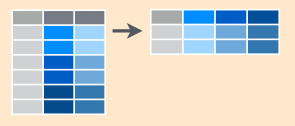
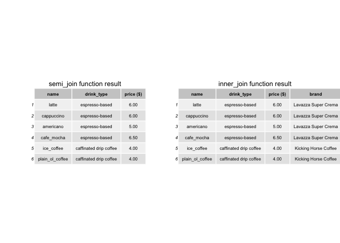

Stat545-HW04-Tidy-data-and-joins
================
Rachel Lobay
2018-10-02

Cheat sheet for tidyr functions
===============================

A very helpful RStudio cheat sheet on tidyr functions and data wrangling can be found [here](https://www.rstudio.com/wp-content/uploads/2015/02/data-wrangling-cheatsheet.pdf). Refer to that guide if you have any immediate questions. It will probably help :smile: My cheat sheet aims to be a highlight reel of that guide along with answering a few other interesting questions. Hence, I will use a few images from the RStudio guide in my own cheat sheet.

Stop. How do we want to handle a data set in RStudio?
=====================================================

The below flow chart gives us an idea of how we want to handle a data set that we use in RStudio. We first want to import the data, tidy it, then do some data manipulations, transformations or modelling. Finally, we can relay our finished product to our targeted audience in a way that is easily accessible.


Ok. The flowchart seems pretty straight-forward. So, first I will load the packages that I will require for this assignment.

By loading the tidyverse package, we get a big bang for our buck because get that the ggplot2, dplyr, tidyr, and tibble packages are also loaded. I also will load the knitr package so we can make sleek tables pretty easily.

``` r
# I suppressed the messages that appear when I load the packages typing ```{r message=FALSE} at the top of this code block. 

library(tidyverse) # load tidyverse package
library(knitr) # for kable() function to make tables spiffy
```

I will use the cereal data set, which I downloaded from [here](https://gist.github.com/SinnerShanky/925f08febd10b40b8b5e). In this data set, there are 74 different types of breakfast cereals, their manufacturer (ie. Nabisco, Quaker Oats, Kellogs, Ralston Purina, General Mills, Post, and American Home Food Products), the calories, protein (g), fat, sodium, dietary fiber, carbs, sugars, display shelf (1, 2 or 3 beginning from the floor shelf), potassium, vitamins and minerals, serving size weight, and cups per serving. Also, I have attached the csv of this data set in my HW04 repo., just in case if it is not loading on Github.

``` r
cereal <- read_csv("https://gist.githubusercontent.com/SinnerShanky/925f08febd10b40b8b5e/raw/61013864f780e43a99349cc1e31fc89b39d862c0/cereal.csv") # read the csv in from the raw file on Github
```

    ## Parsed with column specification:
    ## cols(
    ##   `Cereal Name` = col_character(),
    ##   Manufacturer = col_character(),
    ##   Type = col_character(),
    ##   Calories = col_integer(),
    ##   `Protein (g)` = col_integer(),
    ##   Fat = col_integer(),
    ##   Sodium = col_integer(),
    ##   `Dietary Fiber` = col_double(),
    ##   Carbs = col_double(),
    ##   Sugars = col_integer(),
    ##   `Display Shelf` = col_integer(),
    ##   Potassium = col_integer(),
    ##   `Vitamins and Minerals` = col_integer(),
    ##   `Serving Size Weight` = col_double(),
    ##   `Cups per Serving` = col_double()
    ## )

Let's look at the top six rows of the cereal data set, to get an idea of what the data set looks like. Additionally, I will look at the dimensions of the data set to see if I would like to just look at a subset of the data.

``` r
head(cereal) # see top six rows of dataset. 
```

    ## # A tibble: 6 x 15
    ##   `Cereal Name` Manufacturer Type  Calories `Protein (g)`   Fat Sodium
    ##   <chr>         <chr>        <chr>    <int>         <int> <int>  <int>
    ## 1 100%_Bran     Nabisco      C           70             4     1    130
    ## 2 100%_Natural… Quaker Oats  C          120             3     5     15
    ## 3 All-Bran      Kelloggs     C           70             4     1    260
    ## 4 All-Bran_wit… Kelloggs     C           50             4     0    140
    ## 5 Almond_Delig… Ralston Pur… C          110             2     2    200
    ## 6 Apple_Cinnam… General Mil… C          110             2     2    180
    ## # ... with 8 more variables: `Dietary Fiber` <dbl>, Carbs <dbl>,
    ## #   Sugars <int>, `Display Shelf` <int>, Potassium <int>, `Vitamins and
    ## #   Minerals` <int>, `Serving Size Weight` <dbl>, `Cups per Serving` <dbl>

``` r
dim(cereal) # dimensions are 74 rows by 15 columns
```

    ## [1] 74 15

Since there are a lot of columns to deal with, to we will just use a subset of the data by selecting only the columns we require.

Quick refresher on dplyr
========================

filter() and select() functions
-------------------------------

In the dplyr() package, we have two handy tools to quickly and easily select certain rows or columns of a data frame.

### select() function


The function select() allows us to choose what columns we want from all the possible columns of our data.

**Example:**

We will look at the cereal data and select only the `Cereal Name`, Manufacturer, Calories, Sugars, Protein (g), Fat, and `Display Shelf` columns to keep our lives simple when we do further data manipulation and analysis.

``` r
# Let's use the cereal data to show the select function in action!

cereal_subset <- cereal %>% 
  select(`Cereal Name`, Manufacturer, Calories, Sugars, `Protein (g)`, Fat, `Display Shelf`) # say we just want to select the `Cereal Name`, Manufacturer, Calories, Sugars, Protein (g), Fat, and `Display Shelf` columns.
  
cereal_subset %>% 
  head() %>% # let's look at the top six rows of this subset of the chosen variables
  kable() # kable table it.
```

| Cereal Name                  | Manufacturer   |  Calories|  Sugars|  Protein (g)|  Fat|  Display Shelf|
|:-----------------------------|:---------------|---------:|-------:|------------:|----:|--------------:|
| 100%\_Bran                   | Nabisco        |        70|       6|            4|    1|              3|
| 100%\_Natural\_Bran          | Quaker Oats    |       120|       8|            3|    5|              3|
| All-Bran                     | Kelloggs       |        70|       5|            4|    1|              3|
| All-Bran\_with\_Extra\_Fiber | Kelloggs       |        50|       0|            4|    0|              3|
| Almond\_Delight              | Ralston Purina |       110|       8|            2|    2|              3|
| Apple\_Cinnamon\_Cheerios    | General Mills  |       110|      10|            2|    2|              1|

### filter() function


The function filter() is used to choose the desired rows of the data. For the cereal.subset data, suppose we are a cereal purist and only want the Nabisco cereals. Hence, we will filter the cereal.subset data just for the rows of Nabisco cereals in the next code block.

**Example:**

``` r
# Now let's see the filter() function in action!

cereal_subset_Nabisco <- cereal_subset %>% 
  filter(Manufacturer == "Nabisco") # filter for just the Nabisco cereals 

cereal_subset_Nabisco %>% 
  head() %>% # View top six rows to make sure we only got the Nabisco cereals
  kable() # kable table
```

| Cereal Name                  | Manufacturer |  Calories|  Sugars|  Protein (g)|  Fat|  Display Shelf|
|:-----------------------------|:-------------|---------:|-------:|------------:|----:|--------------:|
| 100%\_Bran                   | Nabisco      |        70|       6|            4|    1|              3|
| Cream\_of\_Wheat\_(Quick)    | Nabisco      |       100|       0|            3|    0|              2|
| Shredded\_Wheat              | Nabisco      |        80|       0|            2|    0|              1|
| Shredded\_Wheat\_'n'Bran     | Nabisco      |        90|       0|            3|    0|              1|
| Shredded\_Wheat\_spoon\_size | Nabisco      |        90|       0|            3|    0|              1|
| Strawberry\_Fruit\_Wheats    | Nabisco      |        90|       5|            2|    0|              2|

Structure of tidyr
------------------


The structure of tidyr is what you would expect. Variables are the column names, while elements (ie. observations) are put into the rows. No surprises here.

Tidyr gather() and spread() functions
-------------------------------------

This table which I adapted from [here](https://tidyr.tidyverse.org), provides a good translation of the terms gather and spread in the reshape2 package, spreadsheets and databases. The translations should help you to gain a intuitive feel for the functions.

| tidyr        | gather  | spread |
|--------------|---------|--------|
| reshape(2)   | melt    | cast   |
| spreadsheets | unpivot | pivot  |
| databases    | fold    | unfold |

Now, let's have a closer look at the structure of the gather() and spread() functions by talking about what exactly to put in the arguments. Note that the image below was obtained from [Tyler Rinker’s minimal guide to tidyr](https://github.com/trinker/tidyr_in_a_nutshell).


The above image explains that in the gather() function. When we use the gather() function, we get a key-value pair. The **key** is the name of a new column for the new variable, while the **value** is the name of the column which will contain values. The **...** refers to the columns that are included or excluded from gather().

The key-value pair is also used in the spread() function. For this function, the **key** is the column that we want to turn into multiple columns, while the **value** corresponds to the values that we want to turn into multiple column values.

### gather() function


The gather function takes data from a wide form and puts it into a long or tidy form. Think of the function as putting data from spreadsheet format into calculation format. The long form the function produces isn't the most visually-appealing, but it makes it easy to perform calculations and operate on the data.

**Example: **

We will put the Sugars, `Protein (g)` and Fat data (which were all measured in grams) into one column called Nutrients using the gather() function.

``` r
cereal_subset_Nabisco_long <- cereal_subset_Nabisco %>% 
  gather(key = "Nutrients", value = Values(g), 3:5) # put sugars, proteins and fat (all in g) of Nabisco cereals into one column called Nutrients

cereal_subset_Nabisco_long # Let's see what happened!
```

    ## # A tibble: 18 x 6
    ##    `Cereal Name`  Manufacturer   Fat `Display Shelf` Nutrients `Values(g)`
    ##    <chr>          <chr>        <int>           <int> <chr>           <int>
    ##  1 100%_Bran      Nabisco          1               3 Calories           70
    ##  2 Cream_of_Whea… Nabisco          0               2 Calories          100
    ##  3 Shredded_Wheat Nabisco          0               1 Calories           80
    ##  4 Shredded_Whea… Nabisco          0               1 Calories           90
    ##  5 Shredded_Whea… Nabisco          0               1 Calories           90
    ##  6 Strawberry_Fr… Nabisco          0               2 Calories           90
    ##  7 100%_Bran      Nabisco          1               3 Sugars              6
    ##  8 Cream_of_Whea… Nabisco          0               2 Sugars              0
    ##  9 Shredded_Wheat Nabisco          0               1 Sugars              0
    ## 10 Shredded_Whea… Nabisco          0               1 Sugars              0
    ## 11 Shredded_Whea… Nabisco          0               1 Sugars              0
    ## 12 Strawberry_Fr… Nabisco          0               2 Sugars              5
    ## 13 100%_Bran      Nabisco          1               3 Protein …           4
    ## 14 Cream_of_Whea… Nabisco          0               2 Protein …           3
    ## 15 Shredded_Wheat Nabisco          0               1 Protein …           2
    ## 16 Shredded_Whea… Nabisco          0               1 Protein …           3
    ## 17 Shredded_Whea… Nabisco          0               1 Protein …           3
    ## 18 Strawberry_Fr… Nabisco          0               2 Protein …           2

We should get the same output if we specify the columns as a range from 3:5 because columns 3 - 5 in the cereal.subset.Nabisco tibble are the sugars, proteins and fat columns.

``` r
cereal_subset_Nabisco_long2 <- cereal_subset_Nabisco %>% 
  gather(key = "Nutrients", value = Values(g), Sugars, `Protein (g)`, Fat) # put sugars, proteins and fat (all in g) of Nabisco cereals into one column called Nutrients

cereal_subset_Nabisco_long2
```

    ## # A tibble: 18 x 6
    ##    `Cereal Name` Manufacturer Calories `Display Shelf` Nutrients
    ##    <chr>         <chr>           <int>           <int> <chr>    
    ##  1 100%_Bran     Nabisco            70               3 Sugars   
    ##  2 Cream_of_Whe… Nabisco           100               2 Sugars   
    ##  3 Shredded_Whe… Nabisco            80               1 Sugars   
    ##  4 Shredded_Whe… Nabisco            90               1 Sugars   
    ##  5 Shredded_Whe… Nabisco            90               1 Sugars   
    ##  6 Strawberry_F… Nabisco            90               2 Sugars   
    ##  7 100%_Bran     Nabisco            70               3 Protein …
    ##  8 Cream_of_Whe… Nabisco           100               2 Protein …
    ##  9 Shredded_Whe… Nabisco            80               1 Protein …
    ## 10 Shredded_Whe… Nabisco            90               1 Protein …
    ## 11 Shredded_Whe… Nabisco            90               1 Protein …
    ## 12 Strawberry_F… Nabisco            90               2 Protein …
    ## 13 100%_Bran     Nabisco            70               3 Fat      
    ## 14 Cream_of_Whe… Nabisco           100               2 Fat      
    ## 15 Shredded_Whe… Nabisco            80               1 Fat      
    ## 16 Shredded_Whe… Nabisco            90               1 Fat      
    ## 17 Shredded_Whe… Nabisco            90               1 Fat      
    ## 18 Strawberry_F… Nabisco            90               2 Fat      
    ## # ... with 1 more variable: `Values(g)` <int>

Booyah! We got the same output, so either way works.

\*\* Example 2: \*\*

Suppose an Australian and an American go shopping for breakfast cereal. So, we want the kilojoules (kJ) listed as energy measurments of the Nabisco cereals as well as the Calories. We can first create a new column with the kilojoules displayed using the mutate() function. Then, we will use the gather() function to make one column called Energy Measure that will have both the Calories and kilojoules of the cereals. So, the value column will containt the number of Calories and the number of kilojoules for each cereal. By using the gather function, the data frame is ready for calculations.

``` r
cereal_subset_Nabisco %>% 
  mutate(kilojoules = Calories * 4.184) %>%  # convert Calories to kilojoules by multiplying the calories by 4.184
  gather(key = "Energy Measurement", value = "Energy Count", Calories, kilojoules) # gather Calories and kilojoules into a column called Energy Measurement and put their values in a column called Energy Count
```

    ## # A tibble: 12 x 8
    ##    `Cereal Name` Manufacturer Sugars `Protein (g)`   Fat `Display Shelf`
    ##    <chr>         <chr>         <int>         <int> <int>           <int>
    ##  1 100%_Bran     Nabisco           6             4     1               3
    ##  2 Cream_of_Whe… Nabisco           0             3     0               2
    ##  3 Shredded_Whe… Nabisco           0             2     0               1
    ##  4 Shredded_Whe… Nabisco           0             3     0               1
    ##  5 Shredded_Whe… Nabisco           0             3     0               1
    ##  6 Strawberry_F… Nabisco           5             2     0               2
    ##  7 100%_Bran     Nabisco           6             4     1               3
    ##  8 Cream_of_Whe… Nabisco           0             3     0               2
    ##  9 Shredded_Whe… Nabisco           0             2     0               1
    ## 10 Shredded_Whe… Nabisco           0             3     0               1
    ## 11 Shredded_Whe… Nabisco           0             3     0               1
    ## 12 Strawberry_F… Nabisco           5             2     0               2
    ## # ... with 2 more variables: `Energy Measurement` <chr>, `Energy
    ## #   Count` <dbl>

### spread() function

The spread function takes data from a long form and puts it into a wide form. Think of the function as putting data from calcuation format to speadsheet format. The wide form is more visually appealing. Hence, it would be useful for displaying data to your targeted audience on a website, in a book, or in an article.



**Example:**

One misleading way to to think of the spread function is that can "undo" the gather function. We must be careful with this line of thinking because the arrangement of the tibble columns may change when we try to "undo" the gather() function, which we will see in the example below. We will step into this trap and show that pitfall by trying to undo what we did with the gather function above to put the sugars, proteins and fat (all in g) of Nabisco cereals into one column called Nutrients.

Using the cereal.subset.Nabisco.long data and the spread() function, we will put the Fat, `Protein (g)`, and Sugars (which were all measured in grams) from the one column called Nutrients into each of their own columns.

``` r
cereal_subset_Nabisco_wide <- cereal_subset_Nabisco_long %>%
  spread(key = "Nutrients", value = "Values(g)") # puts the nutrients  Fat, `Protein (g)`, and Sugars each into their own columns

cereal_subset_Nabisco_wide
```

    ## # A tibble: 6 x 7
    ##   `Cereal Name` Manufacturer   Fat `Display Shelf` Calories `Protein (g)`
    ##   <chr>         <chr>        <int>           <int>    <int>         <int>
    ## 1 100%_Bran     Nabisco          1               3       70             4
    ## 2 Cream_of_Whe… Nabisco          0               2      100             3
    ## 3 Shredded_Whe… Nabisco          0               1       80             2
    ## 4 Shredded_Whe… Nabisco          0               1       90             3
    ## 5 Shredded_Whe… Nabisco          0               1       90             3
    ## 6 Strawberry_F… Nabisco          0               2       90             2
    ## # ... with 1 more variable: Sugars <int>

So, the Nutrients column has now been split back into the Fat, `Protein (g)`, and Sugars columns as we originally had. Note that the order of the columns is now different. It makes sense that the appears that the Fat, `Protein (g)`, and Sugars columns appeared after the `Display Shelf` column because the Nutrients column was after the `Display Shelf` column in the cereal.subset.Nabisco.long tibble. Also, observe that the columns Fat, `Protein (g)`, and Sugars have been sorted alphabetically in the new cereal.subset.Nabisco.wide tibble. We don't have the original order Sugars, `Protein (g)` and Fat that we had in the cereal.subset.Nabisco tibble.

### Introducing the unite() function

We can combine the data from two variables by using the unite() function.

**Example:**

First, we will arrange the Manufacturer\_Shelf column in descending order (ie. top to bottom shelf) by using the dplyr function arrange(). Then, let's unite the columns of Manufacturer and Display Shelf to investigate which manufacturers get top-shelf and bottom-shelf priority.

``` r
manuf_shelf_subset <- cereal_subset %>% 
  arrange(desc(`Display Shelf`)) %>%  # arrange from top to bottom shelf
  unite(Manufacturer_Shelf, Manufacturer, `Display Shelf`) 

# peak at the head of the manuf.shelf.subset 
head(manuf_shelf_subset) %>% 
  kable() # kable table of head of data
```

| Cereal Name                  | Manufacturer\_Shelf |  Calories|  Sugars|  Protein (g)|  Fat|
|:-----------------------------|:--------------------|---------:|-------:|------------:|----:|
| 100%\_Bran                   | Nabisco\_3          |        70|       6|            4|    1|
| 100%\_Natural\_Bran          | Quaker Oats\_3      |       120|       8|            3|    5|
| All-Bran                     | Kelloggs\_3         |        70|       5|            4|    1|
| All-Bran\_with\_Extra\_Fiber | Kelloggs\_3         |        50|       0|            4|    0|
| Almond\_Delight              | Ralston Purina\_3   |       110|       8|            2|    2|
| Basic\_4                     | General Mills\_3    |       130|       8|            3|    2|

Excellent. The top few rows are from the top shelf.

Now, let's check that the bottom few rows of the data to see that the brands are on the first shelf.

``` r
tail(manuf_shelf_subset) %>% 
  kable() # kable table of tail of data
```

| Cereal Name                  | Manufacturer\_Shelf |  Calories|  Sugars|  Protein (g)|  Fat|
|:-----------------------------|:--------------------|---------:|-------:|------------:|----:|
| Shredded\_Wheat\_'n'Bran     | Nabisco\_1          |        90|       0|            3|    0|
| Shredded\_Wheat\_spoon\_size | Nabisco\_1          |        90|       0|            3|    0|
| Special\_K                   | Kelloggs\_1         |       110|       3|            6|    0|
| Wheat\_Chex                  | Ralston Purina\_1   |       100|       3|            3|    1|
| Wheaties                     | General Mills\_1    |       100|       3|            3|    1|
| Wheaties\_Honey\_Gold        | General Mills\_1    |       110|       8|            2|    1|

The tail table is looking good. Now, we should check the whole data set to make sure it runs from the top shelf to the bottom shelf, but I will leave that as a tedious exercise to the reader.

Cheatsheet for dplyr functions
==============================

We already loded the tidyverse package above, so I will not load that again. If we didn't load the tidyverse package above, we should load it so we could access the dplyr package.

So, I will start by constructing a menu for an overpriced coffee shop. This bare-bones menu will contain the name of the drink, the drink type (espresso-based, caffinated drip coffee, or tea), and the pricey price ($) of the drink.

``` r
overpriced_coffee_shop_menu <- "
    name, drink_type, price ($)
 latte, espresso-based, 6.00
   cappuccino, espresso-based, 6.00
americano, espresso-based, 5.00
  cafe_mocha, espresso-based, 6.50
ice_coffee, caffinated drip coffee, 4.00
 plain_ol_coffee, caffinated drip coffee, 4.00
cuppa_tea, tea, 3.00
"

overpriced_coffee_shop_menu <- read_csv(overpriced_coffee_shop_menu, skip = 1)

overpriced_coffee_shop_menu$`price ($)` <- formatC(overpriced_coffee_shop_menu$`price ($)`, format = 'f', flag='0', digits = 2) # make sure price_in_dollars is to two decimal places

(overpriced_coffee_shop_menu) # Let's see the overpriced coffee shop menu!
```

    ## # A tibble: 7 x 3
    ##   name            drink_type             `price ($)`
    ##   <chr>           <chr>                  <chr>      
    ## 1 latte           espresso-based         6.00       
    ## 2 cappuccino      espresso-based         6.00       
    ## 3 americano       espresso-based         5.00       
    ## 4 cafe_mocha      espresso-based         6.50       
    ## 5 ice_coffee      caffinated drip coffee 4.00       
    ## 6 plain_ol_coffee caffinated drip coffee 4.00       
    ## 7 cuppa_tea       tea                    3.00

Next, I will construct a csv for the drink brand for the three drink types, espress-based, tea, and drip coffee.

``` r
coffee_brand <- "
    drink_type, brand
    espresso-based, Lavazza Super Crema
    caffinated drip coffee, Kicking Horse Coffee
    decaf drip coffee, Maxwell House
"

(coffee_brand <- read_csv(coffee_brand, skip = 1))
```

    ## # A tibble: 3 x 2
    ##   drink_type             brand               
    ##   <chr>                  <chr>               
    ## 1 espresso-based         Lavazza Super Crema 
    ## 2 caffinated drip coffee Kicking Horse Coffee
    ## 3 decaf drip coffee      Maxwell House

You will observe that my cheatsheet is structured and patterened after [Jenny's cheatsheet](http://stat545.com/bit001_dplyr-cheatsheet.html). Also, note that the definitions I will refer to for each of the join functions are from [here](https://dplyr.tidyverse.org/reference/join.html).

inner\_join(overpriced\_coffee\_shop\_menu, coffee\_brand)
----------------------------------------------------------

 

> inner\_join(x, y): Return all rows from x where there are matching values in y, and all columns from x and y. If there are multiple matches between x and y, all combination of the matches are returned. This is a mutating join.

``` r
(ij_csm_cb <- inner_join(overpriced_coffee_shop_menu, coffee_brand)) # use the inner_join function to join the two tibbles and show output
```

    ## Joining, by = "drink_type"

    ## # A tibble: 6 x 4
    ##   name            drink_type             `price ($)` brand               
    ##   <chr>           <chr>                  <chr>       <chr>               
    ## 1 latte           espresso-based         6.00        Lavazza Super Crema 
    ## 2 cappuccino      espresso-based         6.00        Lavazza Super Crema 
    ## 3 americano       espresso-based         5.00        Lavazza Super Crema 
    ## 4 cafe_mocha      espresso-based         6.50        Lavazza Super Crema 
    ## 5 ice_coffee      caffinated drip coffee 4.00        Kicking Horse Coffee
    ## 6 plain_ol_coffee caffinated drip coffee 4.00        Kicking Horse Coffee

We can see that the function automatically joins by "coffee\_type". That is because the common variable between both of the tibbles is drink\_type.

Notice that when we use the inner\_join function, we miss the tea brand because the tea brand was not included in the coffee\_type tibble. Additionally, we can see that we get all the variables from both tibbles when we use the inner\_join function.

semi\_join(overpriced\_coffee\_shop\_menu, coffee\_brand)
---------------------------------------------------------

 

> semi\_join(x, y): Return all rows from x where there are matching values in y, keeping just columns from x. A semi join differs from an inner join because an inner join will return one row of x for each matching row of y, where a semi join will never duplicate rows of x. This is a filtering join.

``` r
(sj_csm_cb <- semi_join(overpriced_coffee_shop_menu, coffee_brand)) # use the semi_join function to join the two tibbles and show output
```

    ## Joining, by = "drink_type"

    ## # A tibble: 6 x 3
    ##   name            drink_type             `price ($)`
    ##   <chr>           <chr>                  <chr>      
    ## 1 latte           espresso-based         6.00       
    ## 2 cappuccino      espresso-based         6.00       
    ## 3 americano       espresso-based         5.00       
    ## 4 cafe_mocha      espresso-based         6.50       
    ## 5 ice_coffee      caffinated drip coffee 4.00       
    ## 6 plain_ol_coffee caffinated drip coffee 4.00

As we had with the inner\_join function, we can see that the semi\_joinfunction automatically joins by "coffee\_type". That is because the common variable between both of the tibbles is drink\_type.

Notice that the resulting tibble only contains the variables that we had in overpriced\_coffee\_shop\_menu tibble and not the additional varaibles from the coffee\_brand tibble.

We can easily see the difference between the tibbles resulting from the semi\_join function and the inner\_join function by looking at a side-by-side comparison of them.

I will load the gridExtra package to display the tables side-by-side. Note that in order to use the grid.arrange() function on the two tables, I first had to convert them each to tableGrob. The left is the semi\_join function result, while the right is the inner\_join function result. I couldn't find a quick way to add a title to each tableGrob. I think that revealed one of the drawbacks of usign a tableGrob. Now, the code I used to add a title to each tableGrob was found [here](https://stackoverflow.com/questions/31640916/how-can-i-add-a-title-to-a-tablegrob-plot).

``` r
library(gridExtra) # load gridExtra package 
```

    ## 
    ## Attaching package: 'gridExtra'

    ## The following object is masked from 'package:dplyr':
    ## 
    ##     combine

``` r
library(grid) # load grid package to use textGrob() function to add titles to table (for example, I used function textGrob() from this package)
library(gtable) # load gtable package to add titles to tables (for example, I used functions gtable_add_rows() and gtable_add_grob() from this package).


sj_Grobtable <- tableGrob(sj_csm_cb, theme=ttheme_default(
    core = list(fg_params=list(cex = 0.55)), # smaller table text size
    colhead = list(fg_params=list(cex = 0.55)), 
    rowhead = list(fg_params=list(cex = 0.55)), rows=NULL))  # transform sjcsm into a tableGrob

# add title to sj_Grobtable
title <- textGrob("semi_join function result", gp = gpar(fontsize = 10))
padding <- unit(0.5,"line")
sj_Grobtable <- gtable_add_rows(
  sj_Grobtable, heights = grobHeight(title) + padding, pos = 0
)
sj_Grobtable <- gtable_add_grob(
  sj_Grobtable, list(title),
  t = 1, l = 1, r = ncol(sj_Grobtable)
)


ij_Grobtable <- tableGrob(ij_csm_cb, theme=ttheme_default(
    core = list(fg_params=list(cex = 0.55)), # smaller table text size
    colhead = list(fg_params=list(cex = 0.55)), 
    rowhead = list(fg_params=list(cex = 0.55)), rows=NULL))  # transform ijcsm into a tableGrob

# add title to ij_Grobtable
title <- textGrob("inner_join function result", gp = gpar(fontsize = 10))
padding <- unit(0.5,"line")
ij_Grobtable <- gtable_add_rows(
  ij_Grobtable, heights = grobHeight(title) + padding, pos = 0
)
ij_Grobtable <- gtable_add_grob(
  ij_Grobtable, list(title),
  t = 1, l = 1, r = ncol(ij_Grobtable)
)


grid.arrange(sj_Grobtable, ij_Grobtable, nrow=1) # display tables side-by-side
```



left\_join(overpriced\_coffee\_shop\_menu, coffee\_brand)
---------------------------------------------------------

 

> left\_join(x, y): Return all rows from x, and all columns from x and y. If there are multiple matches between x and y, all combination of the matches are returned. This is a mutating join.

``` r
(lj_csm_cb <- left_join(overpriced_coffee_shop_menu, coffee_brand)) # use the left_join function to join the two tibbles and show output
```

    ## Joining, by = "drink_type"

    ## # A tibble: 7 x 4
    ##   name            drink_type             `price ($)` brand               
    ##   <chr>           <chr>                  <chr>       <chr>               
    ## 1 latte           espresso-based         6.00        Lavazza Super Crema 
    ## 2 cappuccino      espresso-based         6.00        Lavazza Super Crema 
    ## 3 americano       espresso-based         5.00        Lavazza Super Crema 
    ## 4 cafe_mocha      espresso-based         6.50        Lavazza Super Crema 
    ## 5 ice_coffee      caffinated drip coffee 4.00        Kicking Horse Coffee
    ## 6 plain_ol_coffee caffinated drip coffee 4.00        Kicking Horse Coffee
    ## 7 cuppa_tea       tea                    3.00        <NA>

Using left\_join(overpriced\_coffee\_shop\_menu, coffee\_brand), what we get is the overpriced\_coffee\_shop\_menu, but with the addition of the brand column. Also, we can see that cuppa\_tea, which did not have a brand in the coffee\_brand tibble, has an NA for its brand.

right\_join(overpriced\_coffee\_shop\_menu, coffee\_brand)
----------------------------------------------------------

 

> right\_join(x, y): Return all rows from y, and all columns from x and y. Rows in y with no match in x will have NA values in the new columns. If there are multiple matches between x and y, all combinations of the matches are returned.

``` r
(rj_csm_cb <- right_join(overpriced_coffee_shop_menu, coffee_brand)) # use the right_join function to join the two tibbles and show output
```

    ## Joining, by = "drink_type"

    ## # A tibble: 7 x 4
    ##   name            drink_type             `price ($)` brand               
    ##   <chr>           <chr>                  <chr>       <chr>               
    ## 1 latte           espresso-based         6.00        Lavazza Super Crema 
    ## 2 cappuccino      espresso-based         6.00        Lavazza Super Crema 
    ## 3 americano       espresso-based         5.00        Lavazza Super Crema 
    ## 4 cafe_mocha      espresso-based         6.50        Lavazza Super Crema 
    ## 5 ice_coffee      caffinated drip coffee 4.00        Kicking Horse Coffee
    ## 6 plain_ol_coffee caffinated drip coffee 4.00        Kicking Horse Coffee
    ## 7 <NA>            decaf drip coffee      <NA>        Maxwell House

Using right\_join(overpriced\_coffee\_shop\_menu, coffee\_brand), what we are doing is returning all the rows from coffee\_brand and all the columns from overpriced\_coffee\_shop\_menu and coffee\_brand. Hence, om the output, we can see that we now just have the six coffee drinks and no cuppa\_tea row because cuppa\_tea did not have a row listed in the coffee\_brand tibble.

I will display the left\_join function result and the right\_join function result side-by-side for easy comparison. Again, I will use the grobTable to achieve this. The left\_join function result will be on the left, while the right\_join function result will be on the right.

``` r
lj_Grobtable <- tableGrob(lj_csm_cb, theme=ttheme_default(
    core = list(fg_params=list(cex = 0.55)), # smaller table text size
    colhead = list(fg_params=list(cex = 0.55)), 
    rowhead = list(fg_params=list(cex = 0.55)), rows=NULL))  # transform ljcsm into a tableGrob

# add title to lj_Grobtable
title <- textGrob("left_join function result", gp = gpar(fontsize = 10))
padding <- unit(0.5,"line")
lj_Grobtable <- gtable_add_rows(
  lj_Grobtable, heights = grobHeight(title) + padding, pos = 0
)
lj_Grobtable <- gtable_add_grob(
  lj_Grobtable, list(title),
  t = 1, l = 1, r = ncol(lj_Grobtable)
)


rj_Grobtable <- tableGrob(rj_csm_cb, theme=ttheme_default(
    core = list(fg_params=list(cex = 0.55)), # smaller table text size
    colhead = list(fg_params=list(cex = 0.55)), 
    rowhead = list(fg_params=list(cex = 0.55)), rows=NULL))  # transform rjcsm into a tableGrob

# add title to rj_Grobtable
title <- textGrob("right_join function result", gp = gpar(fontsize = 10))
padding <- unit(0.5,"line")
rj_Grobtable <- gtable_add_rows(
  rj_Grobtable, heights = grobHeight(title) + padding, pos = 0
)
rj_Grobtable <- gtable_add_grob(
  rj_Grobtable, list(title),
  t = 1, l = 1, r = ncol(rj_Grobtable)
)


grid.arrange(lj_Grobtable, rj_Grobtable, nrow=1) # display tables side-by-side
```


From the side-by-side comparison of the left\_join and right\_join function results, we can see that the only difference is that right\_join does not have the cuppa\_tea row in its output, whereas left\_join does have that row in its output.

anti\_join(overpriced\_coffee\_shop\_menu, coffee\_brand)
---------------------------------------------------------

 

> anti\_join(x, y): Return all rows from x where there are not matching values in y, keeping just columns from x. This is a filtering join.

``` r
(aj_csm_cb <- anti_join(overpriced_coffee_shop_menu, coffee_brand)) # use the anti_join function to join the two tibbles and show output
```

    ## Joining, by = "drink_type"

    ## # A tibble: 1 x 3
    ##   name      drink_type `price ($)`
    ##   <chr>     <chr>      <chr>      
    ## 1 cuppa_tea tea        3.00

We can see from the anti\_join function output that the only row the overpriced\_coffee\_shop\_menu tibble where there is nomatching values in coffee\_brand is the tea row. Hence, the tea row was the only row in the output (with its column values for drink\_type and `price ($)` from overpriced\_coffee\_shop\_menu).

I will aim to show this clearly by displaying the original tables of overpriced\_coffee\_shop\_menu and coffee\_brand close to the anti\_join reslt for you to see the impact of the anti\_join function. Note I did not put all three tables side-by-side, because the tables overlap when we use tableGrob and the grid.arrange() functions.

``` r
layout <- rbind(c(1,2),
                (3)) # layout will have the original tables of overpriced_coffee_shop_menu and coffee_brand on top and then the full_join table underneath

ocsm_Grobtable <- tableGrob(overpriced_coffee_shop_menu, theme=ttheme_default(   
    core = list(fg_params=list(cex = 0.7)), # smaller table text size
    colhead = list(fg_params=list(cex = 0.7)), 
    rowhead = list(fg_params=list(cex = 0.7)), rows = NULL)) # transform overpriced_coffee_shop_menu into a tableGrob

# add title to ocsm_Grobtable
title <- textGrob("overpriced coffee shop menu", gp = gpar(fontsize = 10))
padding <- unit(0.5,"line")
ocsm_Grobtable <- gtable_add_rows(
  ocsm_Grobtable, heights = grobHeight(title) + padding, pos = 0
)
ocsm_Grobtable <- gtable_add_grob(
  ocsm_Grobtable, list(title),
  t = 1, l = 1, r = ncol(ocsm_Grobtable)
)

coffee_brand_Grobtable <- tableGrob(coffee_brand, theme=ttheme_default(
    core = list(fg_params=list(cex = 0.7)), # smaller table text size
    colhead = list(fg_params=list(cex = 0.7)), 
    rowhead = list(fg_params=list(cex = 0.7)), rows = NULL))  # transform coffee_brand into a tableGrob

# add title to coffee_brand_Grobtable
title <- textGrob("coffee brand table", gp = gpar(fontsize = 10))
padding <- unit(0.5,"line")
coffee_brand_Grobtable <- gtable_add_rows(
  coffee_brand_Grobtable, heights = grobHeight(title) + padding, pos = 0
)
coffee_brand_Grobtable<- gtable_add_grob(
  coffee_brand_Grobtable, list(title),
  t = 1, l = 1, r = ncol(coffee_brand_Grobtable)
)

aj_csm_cb_Grobtable <- tableGrob(aj_csm_cb, theme=ttheme_default(    
    core = list(fg_params=list(cex = 0.7)), # smaller table text size
    colhead = list(fg_params=list(cex = 0.7)), 
    rowhead = list(fg_params=list(cex = 0.7)), rows = NULL))  # transform aj_csm_cb into a tableGrob

# add title to fjcsm_Grobtable
title <- textGrob("anti_join function result", gp = gpar(fontsize = 10))
padding <- unit(0.5,"line")
aj_csm_cb_Grobtable <- gtable_add_rows(
  aj_csm_cb_Grobtable, heights = grobHeight(title) + padding, pos = 0
)
aj_csm_cb_Grobtable <- gtable_add_grob(
  aj_csm_cb_Grobtable, list(title),
  t = 1, l = 1, r = ncol(aj_csm_cb_Grobtable)
)

grid.arrange(ocsm_Grobtable, coffee_brand_Grobtable, aj_csm_cb_Grobtable,layout_matrix=layout) # display tables in the layout we designed using rbind()
```


inner\_join(coffee\_brand, overpriced\_coffee\_shop\_menu)
----------------------------------------------------------

 

> inner\_join(x, y): Return all rows from x where there are matching values in y, and all columns from x and y. If there are multiple matches between x and y, all combination of the matches are returned. This is a mutating join.

``` r
(ij_cb_csm <- inner_join(coffee_brand, overpriced_coffee_shop_menu)) # use the inner_join function to join the two tibbles and show output
```

    ## Joining, by = "drink_type"

    ## # A tibble: 6 x 4
    ##   drink_type             brand                name            `price ($)`
    ##   <chr>                  <chr>                <chr>           <chr>      
    ## 1 espresso-based         Lavazza Super Crema  latte           6.00       
    ## 2 espresso-based         Lavazza Super Crema  cappuccino      6.00       
    ## 3 espresso-based         Lavazza Super Crema  americano       5.00       
    ## 4 espresso-based         Lavazza Super Crema  cafe_mocha      6.50       
    ## 5 caffinated drip coffee Kicking Horse Coffee ice_coffee      4.00       
    ## 6 caffinated drip coffee Kicking Horse Coffee plain_ol_coffee 4.00

When we set x = coffee\_brand and y = overpriced\_coffee\_shop\_menu in the inner\_join function, we see that every coffee\_brand that has a match in the overpriced\_coffee\_shop\_menu shows up once per match.

The resulting table for this inner\_join function is almost exactly the same as the result for the inner\_join function when we set x = overpriced\_coffee\_shop\_menu and y = coffee\_brand. The only difference is the order of the columns (variables).

semi\_join(coffee\_brand, overpriced\_coffee\_shop\_menu)
---------------------------------------------------------

 

> semi\_join(x, y): Return all rows from x where there are matching values in y, keeping just columns from x. A semi join differs from an inner join because an inner join will return one row of x for each matching row of y, where a semi join will never duplicate rows of x. This is a filtering join.

``` r
(sj_cb_csm <- semi_join(coffee_brand, overpriced_coffee_shop_menu)) # use the semi_join function to join the two tibbles and show output
```

    ## Joining, by = "drink_type"

    ## # A tibble: 2 x 2
    ##   drink_type             brand               
    ##   <chr>                  <chr>               
    ## 1 espresso-based         Lavazza Super Crema 
    ## 2 caffinated drip coffee Kicking Horse Coffee

We can see here that when we set x = coffee\_brand and y = overpriced\_coffee\_shop\_menu, the resulting tibble is very similar to the tibble for coffee\_brand. The major difference is that the semi\_join function results in a loss of the decaf drip coffee row, which was under drink\_type in the coffee\_brand tibble. This is because there is no drink\_type that is listed as decaf drip coffee in overpriced\_coffee\_shop\_menu.

I will display the semi\_join() and the inner\_join() function results side-by-side for you to see the difference in output from using each the functions.

``` r
sj_Grobtable <- tableGrob(sj_cb_csm, theme=ttheme_default(
    core = list(fg_params=list(cex = 0.55)), # smaller table text size
    colhead = list(fg_params=list(cex = 0.55)), 
    rowhead = list(fg_params=list(cex = 0.55)), rows=NULL))  # transform sj_cb_csm into a tableGrob

# add title to sj_Grobtable
title <- textGrob("semi_join function result", gp = gpar(fontsize = 10))
padding <- unit(0.5,"line")
sj_Grobtable <- gtable_add_rows(
  sj_Grobtable, heights = grobHeight(title) + padding, pos = 0
)
sj_Grobtable <- gtable_add_grob(
  sj_Grobtable, list(title),
  t = 1, l = 1, r = ncol(sj_Grobtable)
)


ij_Grobtable <- tableGrob(ij_cb_csm, theme=ttheme_default(
    core = list(fg_params=list(cex = 0.55)), # smaller table text size
    colhead = list(fg_params=list(cex = 0.55)), 
    rowhead = list(fg_params=list(cex = 0.55)), rows=NULL))  # transform ijcsm into a tableGrob

# add title to ij_Grobtable
title <- textGrob("inner_join function result", gp = gpar(fontsize = 10))
padding <- unit(0.5,"line")
ij_Grobtable <- gtable_add_rows(
  ij_Grobtable, heights = grobHeight(title) + padding, pos = 0
)
ij_Grobtable <- gtable_add_grob(
  ij_Grobtable, list(title),
  t = 1, l = 1, r = ncol(ij_Grobtable)
)


grid.arrange(sj_Grobtable, ij_Grobtable, nrow=1) # display tables side-by-side
```


left\_join(coffee\_brand, overpriced\_coffee\_shop\_menu)
---------------------------------------------------------

 

> left\_join(x, y): Return all rows from x, and all columns from x and y. If there are multiple matches between x and y, all combination of the matches are returned. This is a mutating join.

``` r
(lj_cb_csm <- left_join(coffee_brand, overpriced_coffee_shop_menu)) # use the left_join function to join the two tibbles and show output
```

    ## Joining, by = "drink_type"

    ## # A tibble: 7 x 4
    ##   drink_type             brand                name            `price ($)`
    ##   <chr>                  <chr>                <chr>           <chr>      
    ## 1 espresso-based         Lavazza Super Crema  latte           6.00       
    ## 2 espresso-based         Lavazza Super Crema  cappuccino      6.00       
    ## 3 espresso-based         Lavazza Super Crema  americano       5.00       
    ## 4 espresso-based         Lavazza Super Crema  cafe_mocha      6.50       
    ## 5 caffinated drip coffee Kicking Horse Coffee ice_coffee      4.00       
    ## 6 caffinated drip coffee Kicking Horse Coffee plain_ol_coffee 4.00       
    ## 7 decaf drip coffee      Maxwell House        <NA>            <NA>

The left\_join(coffee\_brand, overpriced\_coffee\_shop\_menu) output is very similar to the inner\_join(coffee\_brand, overpriced\_coffee\_shop\_menu) output. The difference is that in the output from the left\_join function, we can see that there is a row for the drink\_type decaf drip coffee. Since there is no decaf drip coffee in the overpriced\_coffee\_shop\_menu, the variables from the overpriced\_coffee\_shop\_menu tibble have an NA under them for decaf drip coffee. Meaning, name and `price ($)` have NA for decaf drip coffee.

I will display the left\_join() function close to the original two tables (overpriced\_coffee\_shop\_menu and coffee\_brand) for you to see how the function works. I will skip the comparison of left\_join() with right\_join(), because I think that one side-by-side comparison is enough to go by.

``` r
layout <- rbind(c(1,2),
                (3)) # layout will have the original tables of overpriced_coffee_shop_menu and coffee_brand on top and then the full_join table underneath

ocsm_Grobtable <- tableGrob(overpriced_coffee_shop_menu, theme=ttheme_default(   
    core = list(fg_params=list(cex = 0.7)), # smaller table text size
    colhead = list(fg_params=list(cex = 0.7)), 
    rowhead = list(fg_params=list(cex = 0.7)), rows = NULL)) # transform overpriced_coffee_shop_menu into a tableGrob

# add title to ocsm_Grobtable
title <- textGrob("overpriced coffee shop menu", gp = gpar(fontsize = 10))
padding <- unit(0.5,"line")
ocsm_Grobtable <- gtable_add_rows(
  ocsm_Grobtable, heights = grobHeight(title) + padding, pos = 0
)
ocsm_Grobtable <- gtable_add_grob(
  ocsm_Grobtable, list(title),
  t = 1, l = 1, r = ncol(ocsm_Grobtable)
)

coffee_brand_Grobtable <- tableGrob(coffee_brand, theme=ttheme_default(
    core = list(fg_params=list(cex = 0.7)), # smaller table text size
    colhead = list(fg_params=list(cex = 0.7)), 
    rowhead = list(fg_params=list(cex = 0.7)), rows = NULL))  # transform coffee_brand into a tableGrob

# add title to coffee_brand_Grobtable
title <- textGrob("coffee brand table", gp = gpar(fontsize = 10))
padding <- unit(0.5,"line")
coffee_brand_Grobtable <- gtable_add_rows(
  coffee_brand_Grobtable, heights = grobHeight(title) + padding, pos = 0
)
coffee_brand_Grobtable<- gtable_add_grob(
  coffee_brand_Grobtable, list(title),
  t = 1, l = 1, r = ncol(coffee_brand_Grobtable)
)

lj_Grobtable <- tableGrob(lj_cb_csm, theme=ttheme_default(
    core = list(fg_params=list(cex = 0.7)), # smaller table text size
    colhead = list(fg_params=list(cex = 0.7)), 
    rowhead = list(fg_params=list(cex = 0.7)), rows=NULL))  # transform ljcsm into a tableGrob

# add title to lj_Grobtable
title <- textGrob("left_join function result", gp = gpar(fontsize = 10))
padding <- unit(0.5,"line")
lj_Grobtable <- gtable_add_rows(
  lj_Grobtable, heights = grobHeight(title) + padding, pos = 0
)
lj_Grobtable <- gtable_add_grob(
  lj_Grobtable, list(title),
  t = 1, l = 1, r = ncol(lj_Grobtable)
)

grid.arrange(ocsm_Grobtable, coffee_brand_Grobtable, lj_Grobtable,layout_matrix=layout) # display tables in the layout we designed using rbind()
```


anti\_join(coffee\_brand, overpriced\_coffee\_shop\_menu)
---------------------------------------------------------

 

> anti\_join(x, y): Return all rows from x where there are not matching values in y, keeping just columns from x. This is a filtering join.

``` r
(aj_cb_csm <- anti_join(coffee_brand, overpriced_coffee_shop_menu)) # use the anti_join function to join the two tibbles and show output
```

    ## Joining, by = "drink_type"

    ## # A tibble: 1 x 2
    ##   drink_type        brand        
    ##   <chr>             <chr>        
    ## 1 decaf drip coffee Maxwell House

What we expect to see from the anti\_join function when we put x = coffee\_brand and y = overpriced\_coffee\_shop\_menu is all the rows from coffee\_Brand where there re no matching values in overpriced\_coffee\_shop\_menu. Hence, what appears in the output is the drink\_type decaf drip coffee and its brand Maxwell House because only the decaf drip coffee row did not have any matches in the overpriced\_coffee\_shop\_menu... The Overpriced Coffee Shop is a small store and has not expanded enough to include decaf coffee yet.

Again, I will display the anti\_join() function close to the original two tables (overpriced\_coffee\_shop\_menu and coffee\_brand) for you to get a visual idea of how the anti\_join() function works.

``` r
layout <- rbind(c(1,2),
                (3)) # layout will have the original tables of overpriced_coffee_shop_menu and coffee_brand on top and then the full_join table underneath

ocsm_Grobtable <- tableGrob(overpriced_coffee_shop_menu, theme=ttheme_default(   
    core = list(fg_params=list(cex = 0.7)), # smaller table text size
    colhead = list(fg_params=list(cex = 0.7)), 
    rowhead = list(fg_params=list(cex = 0.7)), rows = NULL)) # transform overpriced_coffee_shop_menu into a tableGrob

# add title to ocsm_Grobtable
title <- textGrob("overpriced coffee shop menu", gp = gpar(fontsize = 10))
padding <- unit(0.5,"line")
ocsm_Grobtable <- gtable_add_rows(
  ocsm_Grobtable, heights = grobHeight(title) + padding, pos = 0
)
ocsm_Grobtable <- gtable_add_grob(
  ocsm_Grobtable, list(title),
  t = 1, l = 1, r = ncol(ocsm_Grobtable)
)

coffee_brand_Grobtable <- tableGrob(coffee_brand, theme=ttheme_default(
    core = list(fg_params=list(cex = 0.7)), # smaller table text size
    colhead = list(fg_params=list(cex = 0.7)), 
    rowhead = list(fg_params=list(cex = 0.7)), rows = NULL))  # transform coffee_brand into a tableGrob

# add title to coffee_brand_Grobtable
title <- textGrob("coffee brand table", gp = gpar(fontsize = 10))
padding <- unit(0.5,"line")
coffee_brand_Grobtable <- gtable_add_rows(
  coffee_brand_Grobtable, heights = grobHeight(title) + padding, pos = 0
)
coffee_brand_Grobtable<- gtable_add_grob(
  coffee_brand_Grobtable, list(title),
  t = 1, l = 1, r = ncol(coffee_brand_Grobtable)
)

aj_cb_csm_Grobtable <- tableGrob(aj_cb_csm, theme=ttheme_default(    
    core = list(fg_params=list(cex = 0.7)), # smaller table text size
    colhead = list(fg_params=list(cex = 0.7)), 
    rowhead = list(fg_params=list(cex = 0.7)), rows = NULL))  # transform aj_csm_cb into a tableGrob

# add title to fjcsm_Grobtable
title <- textGrob("anti_join function result", gp = gpar(fontsize = 10))
padding <- unit(0.5,"line")
aj_cb_csm_Grobtable <- gtable_add_rows(
  aj_cb_csm_Grobtable, heights = grobHeight(title) + padding, pos = 0
)
aj_cb_csm_Grobtable <- gtable_add_grob(
  aj_cb_csm_Grobtable, list(title),
  t = 1, l = 1, r = ncol(aj_cb_csm_Grobtable)
)

grid.arrange(ocsm_Grobtable, coffee_brand_Grobtable, aj_cb_csm_Grobtable,layout_matrix=layout) # display tables in the layout we designed using rbind()
```


full\_join(overpriced\_coffee\_shop\_menu, coffee\_brand)
---------------------------------------------------------

 

full\_join(x, y): Return all rows and all columns from both x and y. Where there are not matching values, returns NA for the one missing. This is a mutating join.

``` r
(fjcsm <- full_join(overpriced_coffee_shop_menu, coffee_brand)) # use the full_join function to join the two tibbles and show output
```

    ## Joining, by = "drink_type"

    ## # A tibble: 8 x 4
    ##   name            drink_type             `price ($)` brand               
    ##   <chr>           <chr>                  <chr>       <chr>               
    ## 1 latte           espresso-based         6.00        Lavazza Super Crema 
    ## 2 cappuccino      espresso-based         6.00        Lavazza Super Crema 
    ## 3 americano       espresso-based         5.00        Lavazza Super Crema 
    ## 4 cafe_mocha      espresso-based         6.50        Lavazza Super Crema 
    ## 5 ice_coffee      caffinated drip coffee 4.00        Kicking Horse Coffee
    ## 6 plain_ol_coffee caffinated drip coffee 4.00        Kicking Horse Coffee
    ## 7 cuppa_tea       tea                    3.00        <NA>                
    ## 8 <NA>            decaf drip coffee      <NA>        Maxwell House

In the output, we see that we have all the rows from overpriced\_coffee\_shop\_menu and a new row from coffee\_brand for decaf drip coffee. So, we get all variables from the overpriced\_coffee\_shop\_menu and the coffee\_brand tibbles. Any of the rows that contain information from only one of the tibbles has NA under the variables from the other tibble.

Let's compare the full\_join table with the original tables of overpriced\_coffee\_shop\_menu and coffee\_brand to see the impact of the full\_join function. Again, I will use tableGrob and grid.arrage() to arrange these tables for an easy viewing experience.

``` r
layout <- rbind(c(1,2),
                (3)) # layout will have the original tables of overpriced_coffee_shop_menu and coffee_brand on top and then the full_join table underneath

ocsm_Grobtable <- tableGrob(overpriced_coffee_shop_menu, theme=ttheme_default(   
    core = list(fg_params=list(cex = 0.7)), # smaller table text size
    colhead = list(fg_params=list(cex = 0.7)), 
    rowhead = list(fg_params=list(cex = 0.7)), rows = NULL)) # transform overpriced_coffee_shop_menu into a tableGrob

# add title to ocsm_Grobtable
title <- textGrob("overpriced coffee shop menu", gp = gpar(fontsize = 10))
padding <- unit(0.5,"line")
ocsm_Grobtable <- gtable_add_rows(
  ocsm_Grobtable, heights = grobHeight(title) + padding, pos = 0
)
ocsm_Grobtable <- gtable_add_grob(
  ocsm_Grobtable, list(title),
  t = 1, l = 1, r = ncol(ocsm_Grobtable)
)

coffee_brand_Grobtable <- tableGrob(coffee_brand, theme=ttheme_default(
    core = list(fg_params=list(cex = 0.7)), # smaller table text size
    colhead = list(fg_params=list(cex = 0.7)), 
    rowhead = list(fg_params=list(cex = 0.7)), rows = NULL))  # transform coffee_brand into a tableGrob

# add title to coffee_brand_Grobtable
title <- textGrob("coffee brand table", gp = gpar(fontsize = 10))
padding <- unit(0.5,"line")
coffee_brand_Grobtable <- gtable_add_rows(
  coffee_brand_Grobtable, heights = grobHeight(title) + padding, pos = 0
)
coffee_brand_Grobtable<- gtable_add_grob(
  coffee_brand_Grobtable, list(title),
  t = 1, l = 1, r = ncol(coffee_brand_Grobtable)
)

fjcsm_Grobtable <- tableGrob(fjcsm, theme=ttheme_default(    
    core = list(fg_params=list(cex = 0.7)), # smaller table text size
    colhead = list(fg_params=list(cex = 0.7)), 
    rowhead = list(fg_params=list(cex = 0.7)), rows = NULL))  # transform fjcsm into a tableGrob

# add title to fjcsm_Grobtable
title <- textGrob("full_join function result", gp = gpar(fontsize = 10))
padding <- unit(0.5,"line")
fjcsm_Grobtable <- gtable_add_rows(
  fjcsm_Grobtable, heights = grobHeight(title) + padding, pos = 0
)
fjcsm_Grobtable <- gtable_add_grob(
  fjcsm_Grobtable, list(title),
  t = 1, l = 1, r = ncol(fjcsm_Grobtable)
)

grid.arrange(ocsm_Grobtable, coffee_brand_Grobtable, fjcsm_Grobtable,layout_matrix=layout) # display tables in the layout we designed using rbind()
```


